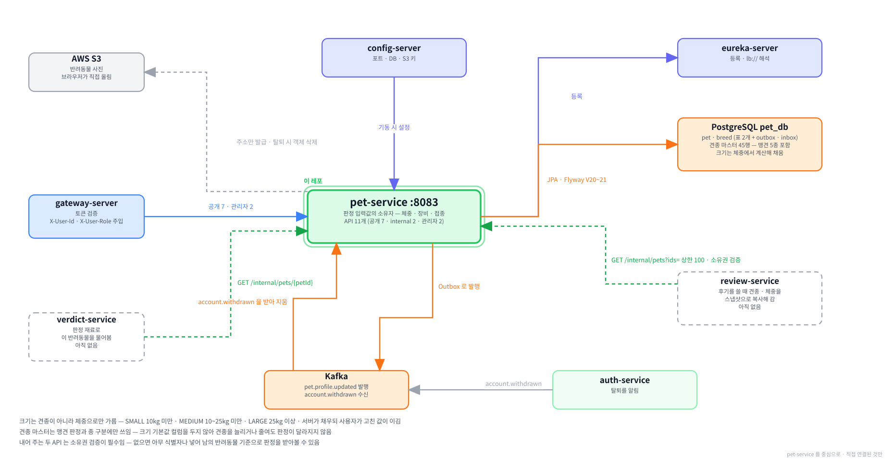

# pet-service

**함께하개**는 반려동물과 함께 갈 수 있는 장소를 찾고, 우리 아이가 그곳에
들어갈 수 있는지 판정해 주는 서비스입니다.

이 저장소는 그중 **반려동물을 맡는 서버**입니다.
판정에 쓰이는 값이 전부 여기에 있고, 그 값이 바뀌면 판정하는 쪽에 알립니다.

---

**먼저 전체 그림을 보고, 이 레포가 그 안 어디에 있는지 본 뒤 읽습니다.**

**① 전체 구조 — 층으로 본 것.** 위에서 아래로 요청이 내려가고, 어느 층에 무엇이 있는지.


**② 전체 구조 — 서비스끼리 무엇을 주고받는지.** 초록 실선이 `/internal` 호출, Kafka 표가 이벤트, 하늘색 점선이 VPC 경계.


**③ 이 레포를 중심으로.** 직접 연결된 것만 남긴 그림.



<br><br>

---

## 본문 시작

<br><br>

---
## 0. 이 서비스가 하는 일

### 0-1. 한 문장

```
                            ┌──▶  verdict 가 판정 재료로 읽음
사용자가 등록 ──▶   pet   ──┼──▶  review 가 후기에 값을 복사해 둠
                 (이 레포)  └──▶  화면이 내 반려동물 목록으로 보여줌
```

**우리 아이가 어떤 아이인지를 들고 있는 곳입니다.**
그 아이가 어디에 들어갈 수 있는지 답하는 일은 `verdict` 가 합니다.

---

### 0-2. 다른 서비스와의 자리

판정은 두 값을 견주는 일입니다. 장소가 무엇을 요구하는지와, 우리 아이가 어떤 아이인지입니다.
이 서비스는 **뒤쪽 절반**을 소유합니다.

```
장소 모으기      place       어디에 갈 수 있는지
조건 뽑기        extract     "10kg 미만" 같은 문장에서 조건을 뽑음
조건 담기        policy      그 장소가 요구하는 것
반려동물         pet         ← 이 레포.  우리 아이가 어떤 아이인지
판정하기         verdict     위 둘을 견주어 답함
```

| | 이 서비스가 | |
|---|---|---|
| 하는 것 | 반려동물을 등록·수정·삭제하고, 견종 목록을 내주고, 판정 재료를 내어 줌 | |
| 안 하는 것 | 판정 | `verdict` 몫. 이 서비스는 재료만 줌 |
| | 조건 해석 | `extract` 몫 |
| | 다른 서비스 호출 | 한 번도 부르지 않음 |
| | 대표 반려동물 지정 | `user` 가 `default_pet_id` 로 가짐 |

⛔**이 서비스는 다른 서비스를 한 번도 부르지 않습니다.** 바깥으로 나가는 통신은 S3 하나뿐이고
그것도 대부분은 서명을 계산하는 일이라 통신조차 아닙니다. `auth` 와 같은 자리입니다.

---

### 0-3. 무엇이 들어 있나

```
pet_db
  pet                 반려동물.  이 표의 컬럼이 곧 판정 규칙의 입력
  breed               견종 마스터 45행.  고정값이며 앱은 읽기만 함
  + outbox            공통 대역.  pet.profile.updated 를 내보냄
  + processed_event   공통 대역.  account.withdrawn 을 받은 기록
```

**이 프로젝트에서 이벤트를 보내기도 하고 받기도 하는 첫 서비스입니다.**

| 서비스 | 이벤트 |
|---|---|
| `auth` | 보내기만 함 |
| `place` | 보내기만 함 |
| `user` | 받기만 함 |
| `pet` | 보내고 받음 |

그래서 `outbox` 와 `processed_event` 를 **둘 다** 씁니다. 표를 만드는 것은 공통 모듈의
`V1__outbox.sql` · `V2__inbox.sql` 이며 이 레포의 마이그레이션은 두 개뿐입니다.

---

### 0-4. 다섯 가지만 기억하면 됩니다

**① 판정에 쓰이는 값이 일곱입니다**

```
weight_kg                 체중
breed_size                크기.  체중에서 계산해 채움
has_carrier               이동장
has_stroller              유모차
vaccine_completed         접종 여부
vaccine_proof_available   증명서 보유
breed_code                견종.  맹견인지를 가리는 데만 씀
```

이름·사진·메모는 판정 축이 아닙니다. 이름만 고치면 판정하는 쪽이 캐시를 지우지 않습니다.

**② 크기는 체중에서 나옵니다**

```
사용자가 보냄  →  그 값을 씀
안 보냄       →  체중으로 계산   10kg 미만 SMALL · 25kg 미만 MEDIUM · 그 이상 LARGE
```

⛔**견종 기본값을 보지 않습니다.** 자세한 것은 [2장](#2-크기를-어떻게-정하는가)에 있습니다.

**③ 견종 표는 크기를 주지 않습니다**

`breed` 에 크기 컬럼이 없습니다. 그 표가 남아 있는 이유는 셋뿐입니다.

```
name_ko        드롭다운에 보일 이름
is_dangerous   맹견인가.  동물보호법 시행규칙 제2조의 5종
species        개인가 아닌가.  화면 안내 문구를 가르는 값
```

**④ 사진은 이 서버를 거치지 않습니다**

주소만 발급하고 브라우저가 S3 로 직접 올립니다. 그래서 서버가 파일 크기만큼의
메모리도 대역폭도 쓰지 않습니다. 자세한 것은 [4장](#4-사진이-도는-길)에 있습니다.

**⑤ 소유권을 항상 봅니다**

`/internal` 두 개를 포함해 모든 조회가 `X-User-Id` 와 `pet.account_id` 를 대조합니다.
안 보면 아무 식별자나 넣어 남의 반려동물 기준으로 판정을 받아 볼 수 있습니다.

---

### 0-5. 화면에서 어디에 쓰이나

| 화면 | 부르는 것 |
|---|---|
| 회원가입 Step 2 — 반려동물 등록 | `GET /api/v1/breeds` · `POST /api/v1/pets/upload-url` · `POST /api/v1/pets` |
| 마이페이지 — 반려동물 정보 수정 | `GET /api/v1/pets` · `PATCH` · `DELETE /api/v1/pets/{petId}` |
| 메인 하단 — 판정 기준 배너 | `GET /api/v1/pets` |
| 후기 작성 | `review` 가 `GET /internal/pets?ids=` 로 대신 물음 |
| 장소 판정 | `verdict` 가 `GET /internal/pets/{petId}` 로 대신 물음 |
| 관리자 — 이벤트 재발행 | `GET /api/v1/admin/pets/outbox` |

⛔**대표 반려동물을 지정하는 API 는 이 서비스에 없습니다.** `PATCH /api/v1/users/me/default-pet`
이며 `user` 가 가집니다. 그 값이 `user_profile` 의 컬럼이기 때문입니다.

<br><br>

---
## 1. 로컬에서 띄우기

### 1-1. 전체 흐름

```
① 인프라 컨테이너를 띄움      postgres · config-server · eureka-server · kafka
② 설정이 내려오는지 봄       curl 로 config-server 에 물어봄
③ 실행 구성에 환경변수 3개    DB 비밀번호 · AWS 키 2개
④ IntelliJ 로 띄움           포트 8083
⑤ 불러 봄                   게이트웨이(8080)를 거쳐서
```

⚠**이 서비스만 띄우면 아무것도 안 됩니다.** 인증이 게이트웨이에 있어 `X-User-Id` 헤더가
붙어 오지 않으면 401 입니다. 검증할 때는 게이트웨이까지 함께 띄우거나,
직결하면서 헤더를 손으로 붙입니다.

---

### 1-2. ① 인프라 컨테이너

`infra` 저장소에서 띄웁니다.

```powershell
# infra 저장소로 이동합니다
cd C:\Tour_Prj\infra

# .env 의 COMPOSE_PROFILES 에 적힌 것이 뜹니다
docker compose up -d

# 무엇이 떴는지 봅니다
docker compose ps
```

```bash
# macOS 는 경로만 다르고 나머지는 같습니다
cd ~/Tour_Prj/infra
docker compose up -d
docker compose ps
```

이 서비스에 필요한 것은 넷입니다.

| 컨테이너 | 프로파일 | 없으면 |
|---|---|---|
| `postgres` | `db` | 기동 실패. `pet_db` 가 없음 |
| `config-server` | `platform` | 포트도 DB 주소도 안 내려와 8080 으로 뜸 |
| `eureka-server` | `platform` | 기동은 되나 게이트웨이가 못 찾음 |
| `kafka` | `infra` | 기동은 되나 이벤트가 나가지도 들어오지도 않음 |

⛔**Redis 는 필요 없습니다.** 이 서비스는 캐시를 쓰지 않아 의존성 자체를 뺐습니다.
`place` 가 쓰지도 않는 Redis 때문에 상태 확인이 실패해 릴리스를 다시 한 적이 있어
복제할 때 그 두 줄을 먼저 지웠습니다.

---

### 1-3. ② 설정 확인

이 레포의 `application.yml` 에는 세 줄밖에 없습니다. 포트도 DB 주소도 전부 설정 저장소에서 옵니다.

```powershell
# 내려올 값을 미리 봅니다
curl.exe -s "http://localhost:8888/pet-service/local"
```

```bash
# macOS 는 curl 을 그대로 씁니다
curl -s "http://localhost:8888/pet-service/local"
```

`server.port` 가 `8083` 이고 `spring.datasource.url` 이 `pet_db` 를 가리키면 정상입니다.

⛔**`Tomcat initialized with port 8080` 이 보이면 설정이 하나도 안 내려온 것입니다.**
`8083` 이 아니라 스프링 기본값으로 뜬 것이며, 원인은 대개 설정 저장소 파일의 문법 오류입니다.
`optional:` 이 붙어 있어 설정 서버를 못 찾아도 조용히 넘어가기 때문에 증상이 원인을 가리키지 않습니다.

---

### 1-4. ③ 실행 구성

IntelliJ 실행 구성의 환경변수에 셋을 넣습니다.

```
SERVICE_DB_PASSWORD     pet_svc 계정 비밀번호.  infra/.env 의 값과 같음
AWS_ACCESS_KEY_ID       pawtrail-pet-service IAM 사용자의 키
AWS_SECRET_ACCESS_KEY
```

⛔**AWS 키는 서비스마다 다릅니다.** 버킷은 `user-service` 와 같은 것을 쓰지만
IAM 사용자는 각각입니다. `pawtrail-user-service` 의 키를 그대로 복사하면 서명 발급은
성공하는데 실제 업로드만 403 이 납니다. 그 사용자의 정책이 `users/*` 로 좁혀져 있기 때문입니다.

```json
{
  "Version": "2012-10-17",
  "Statement": [
    {
      "Sid": "PetPhotoObjects",
      "Effect": "Allow",
      "Action": ["s3:PutObject", "s3:GetObject", "s3:DeleteObject"],
      "Resource": "arn:aws:s3:::pawtrail-media/pets/*"
    }
  ]
}
```

⚠**`s3:ListBucket` 은 없습니다.** 목록을 나열하는 코드가 없기 때문인데, 그 대가로
**객체가 없어도 403 이 옵니다.** 404 대신 403 이 오는 것이라 "지워졌다" 와 "권한이 없다" 를
주소만 보고는 가릴 수 없습니다. 이 함정은 [11장](#11-막히기-쉬운-자리)에 다시 나옵니다.

---

### 1-5. ④ 떴는지 확인

```powershell
# 살아 있는지
curl.exe -s "http://localhost:8083/actuator/health"

# 유레카에 등록됐는지
curl.exe -s "http://localhost:8761/eureka/apps/PET-SERVICE" -H "Accept: application/json"
```

```bash
# macOS
curl -s "http://localhost:8083/actuator/health"
curl -s "http://localhost:8761/eureka/apps/PET-SERVICE" -H "Accept: application/json"
```

⛔**`UP` 만 보고 끝내지 마십시오.** 유레카 컴포넌트가 `UNKNOWN` 이면 전체 판정에서 빠지므로
등록에 실패해도 `UP` 이 그대로 나옵니다. 공통 모듈을 올린 뒤 이 자리에서 조용히 깨진 적이 있습니다.
`registration status: 204` 가 로그에 찍혔는지 함께 봅니다.

로그에 나오지만 문제가 아닌 것이 둘 있습니다.

| 보이는 것 | 뜻 |
|---|---|
| `outOfOrder mode is active` | 설정이 의도적으로 켠 것. 공통 모듈이 나중에 번호를 더해도 실행되게 함 |
| `Zipkin ConnectException` | 관측 스택을 안 띄웠을 뿐. 기능과 무관 |

---

### 1-6. ⑤ 바로 불러 보기

게이트웨이를 거쳐 부릅니다. 로그인 쿠키가 있어야 합니다.

```powershell
# 로그인해서 쿠키를 받습니다
Set-Content -Path login.json -Encoding ascii `
    -Value '{"email":"pawtrail.noreply+u1@gmail.com","password":"test1234"}'
curl.exe -s -c cookies.txt -X POST "http://localhost:8080/api/v1/auth/login" `
    -H "Content-Type: application/json" -d "@login.json"

# 견종 목록
curl.exe -s -b cookies.txt "http://localhost:8080/api/v1/breeds" -w "`n[%{http_code}]`n"

# 내 반려동물
curl.exe -s -b cookies.txt "http://localhost:8080/api/v1/pets" -w "`n[%{http_code}]`n"
```

```bash
# macOS. 본문을 인라인으로 넣어도 따옴표가 벗겨지지 않습니다
curl -s -c cookies.txt -X POST "http://localhost:8080/api/v1/auth/login" \
    -H "Content-Type: application/json" \
    -d '{"email":"pawtrail.noreply+u1@gmail.com","password":"test1234"}'

curl -s -b cookies.txt "http://localhost:8080/api/v1/breeds" -w "\n[%{http_code}]\n"
curl -s -b cookies.txt "http://localhost:8080/api/v1/pets" -w "\n[%{http_code}]\n"
```

⚠**PowerShell 은 인라인 JSON 의 따옴표를 벗깁니다.** 그래서 본문을 파일로 빼서
`-d "@파일"` 로 보냅니다. macOS 의 bash · zsh 에는 해당하지 않습니다.

⚠**검증이 끝나면 `login.json` 과 `cookies.txt` 를 지우십시오.** 평문 비밀번호와
유효한 리프레시 토큰이 파일로 남습니다. 두 파일 다 `.gitignore` 에 없습니다.

`/internal` 두 개는 게이트웨이가 라우팅하지 않습니다. 직결하면서 헤더를 손으로 붙입니다.

```powershell
curl.exe -s "http://localhost:8083/internal/pets/$petId" `
    -H "X-User-Id: $accountId" -H "X-User-Role: USER" -w "`n[%{http_code}]`n"
```

```bash
curl -s "http://localhost:8083/internal/pets/$petId" \
    -H "X-User-Id: $accountId" -H "X-User-Role: USER" -w "\n[%{http_code}]\n"
```

<br><br>

---
## 2. 크기를 어떻게 정하는가

### 2-1. 판정 축이 둘인데 크기는 한쪽에만 쓰입니다

장소가 몸집을 제한하는 방식이 둘입니다.

| 조건이 적힌 방식 | 예 | 판정이 보는 값 |
|---|---|---|
| 킬로그램으로 적힘 | "10kg 미만" | `pet.weight_kg` |
| 말로 적힘 | "소형견만 가능" | `pet.breed_size` |

⛔**킬로그램으로 적힌 조건은 크기를 아예 거치지 않습니다.** 체중을 그대로 견줍니다.
크기가 쓰이는 곳은 "소형견만" 처럼 **말로 적힌 조건**뿐이고, 실측에서 그런 조건은
고캠핑 447건 · 문화정보원 262건으로 709건이었습니다.

이 사실이 아래 결정 전부의 바탕입니다. 크기를 정교하게 만드는 데 드는 비용이
그 709건에만 걸립니다.

---

### 2-2. 순서는 사용자 지정, 그다음 체중

```
POST /pets 요청에 breedSize 가 옴   →  그 값을 그대로 씀
                    안 옴          →  BreedSize.fromWeight(weightKg) 로 계산
```

두 단계뿐입니다. `BreedSize` 의 정적 메서드가 그 계산을 가집니다.

```java
public static BreedSize fromWeight(BigDecimal weightKg) {
    if (weightKg.compareTo(LARGE_FROM) >= 0) {
        return LARGE;
    }
    if (weightKg.compareTo(MEDIUM_FROM) >= 0) {
        return MEDIUM;
    }
    return SMALL;
}
```

**계산을 서비스가 아니라 이 enum 에 둔 이유**는 값과 경계가 짝이기 때문입니다.
세 값과 두 경계는 하나를 고치면 반드시 다른 하나도 봐야 하는 관계라, 갈라 두면
값을 늘리고 규칙을 안 고치는 자리가 생깁니다. 순수 함수라 경계값 시험이
데이터베이스도 목도 없이 끝난다는 이점이 따라옵니다.

부르는 자리가 둘입니다. 등록과 수정이며, 수정도 같은 메서드를 그대로 씁니다.

---

### 2-3. 경계값은 문서가 부등호까지 정합니다

```
 9.9kg  SMALL
10.0kg  MEDIUM      ← 경계가 MEDIUM 쪽
24.9kg  MEDIUM
25.0kg  LARGE       ← 경계가 LARGE 쪽
```

출처는 국립축산과학원 「반려견 소개」이며 미국수의학협회 자료를 소개한 것입니다.

⚠**그 문서가 스스로 "품종을 구분하는 공식 분류체계가 아니다" 라고 밝히고 있습니다.**
화면이 *"kg 기준 변환이라 업장 기준과 다를 수 있으니 전화 문의를 권장합니다"* 를
함께 안내하는 근거가 이것입니다.

비교에 `compareTo` 를 씁니다. `equals` 는 자릿수까지 보므로 `10` 과 `10.0` 을
다른 값으로 봅니다.

---

### 2-4. 견종 기본값을 보지 않는 이유

처음 설계는 `breed.default_size` 컬럼을 두고 순서를 셋으로 잡는 것이었습니다.

```
사용자 지정  >  견종 기본값  >  체중
```

**가운데를 없앴습니다.** 결정적 근거는 하나입니다.

⛔**견종 기본값은 도움이 가장 필요한 사람에게 닿지 않습니다.**
순종 보호자는 자기 개가 대형견인지 이미 압니다. 정작 크기를 모르는 쪽은 믹스견 보호자인데
`MIX` 에는 기본값을 넣을 수가 없습니다. 자동으로 채워 주기로 한 목적이
*"믹스견 보호자가 크기를 고르다 이탈하는 것"* 을 막는 것이었는데, 체중은 그 목적을 달성하고
견종은 못 합니다.

따라오는 이득이 셋 더 있습니다.

```
출처가 하나로 끝남      국립축산과학원 kg 기준 한 줄.  대외 문서 설명이 짧아짐
관리 비용이 사라짐      견종 수백 종의 크기 출처를 찾고 개정을 따라갈 일이 없음
목록을 작게 가져감      크기를 안 주므로 견종을 늘려도 판정이 달라지지 않음
```

⚠**한 번 반대로 정했다가 뒤집은 자리입니다.** `max(견종, 체중)` 으로 가자는 안이
있었는데, 그때 든 예시가 *"11kg 말티즈가 10kg 미만 장소에 간다"* 였습니다.
그 상황은 `weight_kg` 를 직접 보는 조건이라 크기와 아무 상관이 없었습니다.
근거가 예시부터 틀렸던 것입니다.

---

### 2-5. 유도값인데도 저장하는 유일한 자리

`breed_size` 는 체중에서 계산되는 값입니다. 그런데도 컬럼으로 저장합니다.

⛔**사용자가 고칠 수 있기 때문입니다.** 계산만으로는 *"서버가 채운 값"* 과
*"사용자가 고친 값"* 을 구분할 수단이 없습니다. 컬럼이 그 구분을 담는 유일한 자리입니다.

이 프로젝트는 유도할 수 있는 값을 컬럼으로 두지 않는 쪽을 계속 택해 왔습니다.
`pet.species` 와 `pet.is_dangerous_breed` 를 두지 않고 `breed` 를 조인해 채우는 것,
`user_profile` 의 `stats` 를 두지 않고 조회할 때 세는 것이 그렇습니다.
크기만 예외인 이유가 위의 한 줄입니다.

---

### 2-6. 이 방식의 대가

⚠**성장 중인 대형견이 작게 분류됩니다.** 생후 6개월 8kg 리트리버는 `SMALL` 이 되어
"소형견만" 인 709건을 통과합니다.

막는 장치가 둘입니다.

```
① 사용자가 크기 드롭다운으로 고침    POST /pets 가 breedSize 를 선택 필드로 받음
② 화면 문구                       "kg 기준 변환이라 업장 기준과 다를 수 있음"
```

**나이 컬럼을 두지 않은 것도 여기서 정해졌습니다.** 생년월일을 받아도 다 자란 체중을
예측할 수단이 없고, 견종을 안 보기로 해 참조할 값도 없어졌습니다. 위 둘로 감수합니다.

<br><br>

---
## 3. 견종 45행이 하는 일

### 3-1. 무엇에 쓰이나

`breed` 표에서 읽어 쓰는 값이 셋뿐입니다.

```
name_ko        드롭다운 표기        GET /api/v1/breeds 가 내보냄
is_dangerous   맹견 판정            verdict 의 breed_rule 이 봄
species        안내 문구 분기        프론트가 "개 기준입니다" 를 띄울지 정함
```

⛔**크기는 여기서 나오지 않습니다.** `default_size` 컬럼 자체가 없습니다.
그래서 **견종을 늘리거나 줄여도 판정 결과가 달라지지 않습니다.** 견종이 판정에
쓰이는 곳은 맹견 여부 하나뿐입니다.

---

### 3-2. 45행의 구성

```
일반 견종        38종     전부 species = DOG · is_dangerous = false
맹견             5종      is_dangerous = true.  동물보호법 시행규칙 제2조
목록 맨 끝       2행      MIX · OTHER
                ────
          합계  45행
```

**목록의 근거가 셋으로 갈립니다.**

| 범위 | 근거 |
|---|---|
| 상위 7종 | KB금융지주 경영연구소 「한국 반려동물보고서」 |
| 맹견 5종 | 동물보호법 시행규칙 제2조 |
| 나머지 | 국내에서 흔한 견종으로 골랐으며 순위를 주장하지 않음 |

⚠**대외 문서에는 "주요 견종" 으로만 적고 순위를 주장하지 마십시오.** 세 번째 묶음은
출처가 있는 값이 아닙니다.

⛔**푸들·닥스훈트·슈나우저를 크기별로 쪼개지 않았습니다.** 토이·미니어처·스탠더드를
가르는 것은 `default_size` 가 있을 때만 의미가 있었는데 그 컬럼이 없어졌습니다.

---

### 3-3. 맹견 5종은 법이 정합니다

```
TOSA                         도사견
AMERICAN_PIT_BULL_TERRIER    아메리칸 핏불테리어
AMERICAN_STAFFORDSHIRE       아메리칸 스태퍼드셔 테리어
STAFFORDSHIRE_BULL_TERRIER   스태퍼드셔 불 테리어
ROTTWEILER                   로트와일러
```

이 다섯은 고를 수 있는 목록이 아니라 **반드시 들어가야 하는 값**입니다.
동물보호법 시행규칙 제2조가 정한 목록이기 때문입니다.

⚠**`AMERICAN_STAFFORDSHIRE` 만 코드가 법령 명칭과 다릅니다.**
`AMERICAN_STAFFORDSHIRE_TERRIER` 는 30자라 `varchar(30)` 에 여유가 하나도 없습니다.
코드만 22자로 줄이고 `name_ko` 는 법령 명칭 그대로 두었습니다.
판정은 코드가 아니라 `is_dangerous` 를 보므로 영향이 없습니다.

⚠**법은 "그 잡종의 개" 까지 포함합니다.** 잡종은 판정할 수 없으므로 `MIX` 는 거짓으로 두고
맹견 제한 장소의 안내 문구로 보완합니다.

---

### 3-4. 맨 끝 두 줄 — `MIX` 와 `OTHER`

```
MIX     믹스 · 목록에 없는 견종      species = DOG · is_dangerous = false
OTHER   그 외 (고양이 등)           species = ETC
```

**`MIX` 의 표기를 넓힌 것이 요점입니다.** 원래는 "믹스견" 이었습니다.

목록을 작게 가져가기로 하면서 **순종인데 목록에 없는 개**가 생깁니다.
표기가 "믹스견" 뿐이면 그 보호자가 `OTHER` 를 고르게 되고, `species` 가 `ETC` 가 되어
장소 상세에 *"이 기준은 강아지 기준이라 다를 수 있습니다"* 가 **잘못 뜹니다.**

`OTHER` 를 둔 근거는 그대로입니다. 소스 실측에서 **고양이를 명시한 동반 조건이
하나도 나오지 않았습니다.** 조건 문구가 전부 개를 전제로 쓰여 있습니다.

⛔**종이 개가 아니어도 판정은 개 기준으로 그대로 수행합니다.** 판정을 아예 안 하면
"그 외" 를 고른 사용자가 등록만 되고 서비스를 못 씁니다. 대신 장소 상세 상단에만
안내 문구 한 줄을 띄우며, 그 판단은 프론트가 `species` 로 합니다.
그래서 `pet` 표에 `verdict_supported` 같은 컬럼이 없습니다.

---

### 3-5. ⛔한글 정렬을 데이터베이스에 맡기지 않습니다

**이 서비스에서 실제로 깨졌던 자리이고, 다른 서비스도 그대로 밟을 수 있습니다.**

처음에는 질의에 `ORDER BY b.nameKo` 를 두었습니다. 나온 순서가 이랬습니다.

```
비글 · 시츄 · 퍼그 · 푸들        ← 두 글자
도사견 · 말티즈 · 불도그         ← 세 글자
닥스훈트 · 달마시안              ← 네 글자
```

**글자 수가 먼저고 그 안에서만 가나다였습니다.** 말티즈가 ㅁ 자리가 아니라
세 글자 무리에 끼어 사용자가 자기 개를 찾을 수 없었습니다.

시험이 이것을 못 잡은 이유가 둘입니다.

```
① 테스트 컨테이너와 로컬 pet_db 의 이미지가 달라 콜레이션도 다름
   postgres:17-alpine  vs  postgis/postgis:17-3.5
   질의에 맡기면 검사를 통과해도 실물이 틀림

② 정렬 검사를 아예 빼 두었음
   "콜레이션에 달려 있어 깨지기 쉽다" 고 판단해 가나다 단언을 넣지 않았음
   진단은 맞았고 결론이 틀렸음 — 검사를 빼는 게 아니라 정렬을 옮겼어야 했음
```

**해법은 정렬을 저장소 구현으로 옮기는 것이었습니다.**

```java
private static final Comparator<Breed> DROPDOWN_ORDER =
        Comparator.comparingInt(BreedRepositoryImpl::tailRank)
                .thenComparing(Breed::getNameKo);
```

자바 문자열의 자연 순서는 코드포인트 순이고, 한글 음절이 유니코드에 가나다 순으로
이어져 있어 사전 순과 같아집니다. **환경에서 완전히 떨어지므로 가나다 단언을
시험에 되살릴 수 있게 되었습니다.** 이제 그 검사는 콜레이션이 아니라 우리 코드를 봅니다.

⚠**45행짜리 고정 마스터라 메모리에서 세우는 비용을 잴 것이 없습니다.**
`search` 처럼 큰 목록에는 같은 판단을 그대로 쓰지 마십시오.

⛔기각한 안 — `ORDER BY ... COLLATE "C"` 는 HQL 이 지원하는지 확인해야 하고
안 되면 네이티브 쿼리로 내려갑니다. 얻는 것에 비해 붙는 것이 많습니다.

`MIX` 와 `OTHER` 를 맨 끝으로 보내는 것도 같은 비교자가 합니다.

```java
private static int tailRank(Breed breed) {
    if (MIX.equals(breed.getCode())) {
        return MIX_RANK;      // 1
    }
    if (OTHER.equals(breed.getCode())) {
        return OTHER_RANK;    // 2
    }
    return HEAD;              // 0
}
```

⚠**둘에 같은 순번을 주면 안 됩니다.** 처음에 `CASE WHEN code IN ('MIX','OTHER') THEN 1` 로
묶었더니 둘이 같은 값을 받아 이름순으로 갈렸고 "그 외" 가 "믹스" 보다 앞섰습니다.

---

### 3-6. Flyway seed 로 넣은 이유

`V21__breed_seed.sql` 이 45행을 `INSERT` 합니다.
**이 프로젝트의 첫 seed 스크립트입니다.** `auth` · `user` · `place` · `ingest` 의
마이그레이션 15개가 전부 DDL 뿐이었습니다.

```
created_by · updated_by 를 'flyway' 로 직접 씁니다
  BaseEntity 의 두 컬럼이 NOT NULL 인데 SQL INSERT 라 JPA Auditing 이 돌지 않음
  'system' 이 아니라 'flyway' 로 둔 것은 어느 경로로 들어온 행인지 드러나게 하려는 것
  배치가 남기는 ingest-batch · extract-batch 와 같은 결
```

⛔기각한 안 — `data/` 에 CSV 를 두고 기동할 때 읽어 담는 방식입니다.
`ingest` 의 CSV 는 수집이 읽는 원천 데이터이고 `breed` 는 마스터 표라 성격이 다릅니다.
기동 경로에 읽기와 upsert 를 붙이면 `place` 가 겪은 것과 같은 종류의 위험이 생깁니다.

⚠**견종을 더하거나 고치는 일은 다음 번호의 마이그레이션으로 합니다.**
`V21` 은 이미 적용되어 체크섬이 기록돼 있으므로 한 글자만 바꿔도 다음 기동이 실패합니다.

<br><br>

---
## 4. 사진이 도는 길

### 4-1. 3단계

```
① 주소 발급          브라우저 ──▶  pet     POST /api/v1/pets/upload-url
                             ◀──          uploadUrl · fileUrl · expiresIn

② 올리기            브라우저 ──▶  S3      PUT uploadUrl  (파일 본문)

③ 등록              브라우저 ──▶  pet     POST /api/v1/pets  { photoUrl: fileUrl }
```

⛔**파일이 이 서버를 거치지 않습니다.** 주소만 만들어 주고 브라우저가 S3 로 직접 올립니다.
그래서 서버가 파일 크기만큼의 메모리도 대역폭도 쓰지 않습니다.
이름이 `uploads` 가 아니라 `upload-url` 인 이유가 그것입니다.

**서명을 만드는 일은 통신이 아닙니다.** 액세스 키로 문자열에 서명하는 계산이라
S3 를 부르지 않습니다. 권한은 그 서명으로 **실제 요청이 갈 때** 걸립니다.
그래서 키가 틀려도 발급은 200 이고 `PUT` 만 403 이 납니다.

발급 요청이 받는 것이 셋입니다.

| 값 | 쓰임 |
|---|---|
| `fileName` | 화면이 보여 줄 값. ⛔키에는 쓰지 않음 |
| `contentType` | `image/jpeg` 와 `image/png` 만. 서명에 들어감 |
| `contentLength` | 정확한 바이트 수. 서명에 들어감 |

⚠**`contentLength` 는 범위가 아니라 정확한 값입니다.** 프론트가 `file.size` 를 그대로
보내야 하고, 리사이즈를 한다면 **줄인 결과의 크기**를 보내야 합니다.
`PUT` 할 때 `Content-Type` 헤더도 요청한 값과 똑같아야 합니다. 둘 다 서명에 들어 있어
하나라도 다르면 S3 가 403 으로 거부합니다.

크기 상한은 서비스가 봅니다. 서명은 *"요청한 크기와 다른 것"* 만 막을 뿐
상한 자체를 막지는 못하기 때문입니다. 넘으면 주소를 아예 발급하지 않으므로
S3 로 요청이 가지도 않습니다.

---

### 4-2. 키가 `pets/{계정}/{uuid}` 인 이유

```
pets/01a0726a-.../3f2b91c4-...
     └ accountId  └ 서버가 만든 파일 이름
```

**`{uuid}` 는 서버가 만드는 파일 이름이고 `petId` 와 아무 관계가 없습니다.**
`Pet.id` 는 등록 시점에 따로 발급되며 둘은 영영 만나지 않습니다.

| 안 쓰는 것 | 이유 |
|---|---|
| `petId` | 사진을 먼저 올리는 흐름이라 이 시점에 반려동물이 아직 없음 |
| `fileName` | 정규화를 한 번 빠뜨리면 `..` 나 `/` 가 남의 계정 자리를 가리킴 |
| 확장자 | 브라우저는 `Content-Type` 헤더를 보고 그림. 그 값은 S3 가 보관함 |

**`user-service` 와 갈리는 자리가 여기입니다.**

| | `user` | `pet` |
|---|---|---|
| 키 | `users/{계정}/profile` 고정 | `pets/{계정}/{uuid}` 매번 새로 |
| 왜 | 계정당 사진이 하나라 덮어써짐 | 한 사람이 여러 마리라 덮어쓰기가 성립하지 않음 |
| 옛 파일 | 덮어써져 지울 일이 없음 | ⛔직접 지워야 함 |

⛔기각한 안 — 임시 자리에 올리고 등록할 때 옮기는 방식입니다.
S3 복사·삭제·수명 규칙·실패 처리가 등록 트랜잭션에 끼어듭니다.

⚠**등록하지 않고 이탈하면 고아 파일이 남습니다.** 접두사에 계정 식별자를 넣어 두었으므로
나중에 수명 주기 규칙이나 일회성 정리 작업으로 치울 수 있습니다.

---

### 4-3. 들고 온 주소를 검증합니다

등록 요청의 `photoUrl` 은 **우리 버킷의, 그 계정 자리의 주소인지** 확인한 뒤에 저장합니다.

```
① 쿼리나 조각이 붙어 있으면 거부      발급한 fileUrl 에는 둘 다 없음
② https 가 아니면 거부
③ 호스트가 {버킷}.s3.{리전}.amazonaws.com 이 아니면 거부
④ 경로가 pets/{그 계정}/ 로 시작하지 않으면 거부
```

⛔**문자열을 잘라 쓰지 않고 `URI` 로 파싱합니다.** 접두사만 견주면
**서명이 붙은 업로드 주소가 그대로 통과합니다.**

```
https://버킷.s3.리전.amazonaws.com/pets/{계정}/{uuid}?X-Amz-Algorithm=...
```

이 값은 접두사도 맞고 계정 자리도 맞습니다. 그런데 잘라 내면 키에 쿼리까지 들어가고,
그 문자열로 조회 서명을 만들면 존재하지 않는 객체를 가리켜 **사진이 열리지 않습니다.**
①이 그것을 막는 검사이며 실제로 검증 중에 이 버그가 드러났습니다.

경로를 볼 때는 `getRawPath` 가 아니라 `getPath` 를 씁니다.
퍼센트 인코딩이 이미 풀린 값이라야 `%2E%2E` 같은 표기가 검사를 지나가지 않습니다.

⛔**④가 없으면 남의 키를 자기 반려동물에 붙일 수 있습니다.** 그러면 삭제 코드가
생기는 순간 **남의 파일을 지우는 도구**가 됩니다. `user` 가 `fileUrl` 을 대조하는 것과
같은 결이며, 거기는 키가 고정이라 "발급한 주소와 완전히 같은지" 만 보면 됐습니다.

---

### 4-4. 지우는 자리가 셋입니다

```
① PATCH 로 사진 교체        옛 객체를 지움
② PATCH 로 photoUrl 을 null  그 객체를 지움
③ DELETE 로 반려동물 삭제     그 객체를 지움
④ account.withdrawn 소비    그 계정의 반려동물 사진을 전부 지움
```

⛔**안 지우면 영영 안 지워집니다.** 키가 매번 새로 생겨 덮어쓰기가 없으므로
사진을 열 번 바꾸면 객체가 열 개 남습니다. 나중에 정리하려면
*"어느 것이 고아인가"* 를 알아내는 작업이 통째로 필요해집니다.

**지우는 시점이 두 갈래로 갈립니다.** 이 구분이 이 서비스에서 가장 헷갈리는 자리입니다.

| 경로 | 언제 지우나 | 왜 |
|---|---|---|
| ①②③ 사용자 요청 | 커밋 **뒤** (`AfterCommitExecutor`) | 트랜잭션 안에서 지웠다가 롤백되면 반려동물은 남고 사진만 사라져 **깨진 이미지가 프로필에 박힘** |
| ④ 탈퇴 | 트랜잭션 **안** | 전부 지우는 일이라 롤백되면 "아무것도 안 지워진" 상태로 돌아감. 미룰 이유가 없음 |

⛔**④를 커밋 뒤로 미루면 안 되는 이유가 더 있습니다.** `AfterCommitExecutor` 는 예외를
로그만 남기고 끝내므로 **이벤트 소비는 성공으로 처리됩니다.** 재시도도 DLQ 도 돌지 않고,
행을 이미 지워 그 키를 다시 찾을 길도 없습니다. *"탈퇴하면 사용자 데이터를 지운다"* 는
약속을 못 지키게 됩니다.

일부만 지운 뒤 실패해도 멱등합니다. 재발행하면 없는 키를 지우는 것이고 S3 는 오류를 내지 않습니다.

⚠**탈퇴에서도 접두사로 통째 지우지 않고 행에서 키를 모아 지웁니다.**
접두사 삭제에는 `ListObjectsV2` 가 필요하고 그러려면 IAM 에 `s3:ListBucket` 을 열어야 합니다.
한 사람이 가진 반려동물이 많아야 서너 마리라 호출 수가 부담이 아니고,
권한을 좁게 유지하는 편이 낫다고 보았습니다.

---

### 4-5. ⛔이 응답은 캐시하면 안 됩니다

`photoUrl` 은 **매번 새로 서명해 내보냅니다.** 버킷이 퍼블릭 액세스를 차단해 두어
저장된 주소 그대로는 열리지 않기 때문입니다.

```
저장하는 값      pets/{계정}/{uuid}                       키
내보내는 값      https://...?X-Amz-Expires=3600&...       1시간 뒤 만료
```

⛔**캐시해 두면 서명이 만료돼 깨진 이미지가 뜹니다.** 해당 화면이 셋입니다.

```
회원가입 Step 2 · 반려동물 정보 수정 · 메인 하단 판정 기준 배너
```

`user` 의 `GET /internal/users?ids=` 도 정확히 같은 제약을 가집니다.
프로필 사진이 같은 방식으로 나가기 때문입니다.

⚠**나중에 CloudFront 로 옮기면 주소가 고정이 되어 이 제약이 사라집니다.**

`/internal` 두 개는 이 문제가 없습니다. 아예 `photoUrl` 을 담지 않기 때문입니다.
`review` 는 견종·체중·크기만 복사하고 `verdict` 는 판정 축만 보므로 둘 다 사진을 쓰지 않습니다.
100마리를 물었을 때 쓰지도 않을 서명을 100번 만들지 않으려고 출력 객체를 따로 두었습니다.
<br><br>

---
## 5. API 11개

### 5-1. 한눈에

```
공개      POST   /api/v1/pets                    등록
          GET    /api/v1/pets                    내 반려동물 전부
          GET    /api/v1/pets/{petId}            하나
          PATCH  /api/v1/pets/{petId}            수정
          DELETE /api/v1/pets/{petId}            삭제
          POST   /api/v1/pets/upload-url         사진 올릴 주소 발급
          GET    /api/v1/breeds                  견종 드롭다운

internal  GET    /internal/pets?ids=             review 가 스냅샷을 복사할 때
          GET    /internal/pets/{petId}          verdict 가 판정 재료로

관리자     GET    /api/v1/admin/pets/outbox       멈춘 이벤트 목록
          POST   /api/v1/admin/pets/outbox/{id}/retry
```

응답은 전부 공통 래퍼에 담깁니다.

```json
{ "success": true, "data": { }, "traceId": "..." }
```

⛔**경로에 `accountId` 가 한 번도 나오지 않습니다.** 게이트웨이가 토큰을 검증해
`X-User-Id` 헤더로 넣어 주고 공통 모듈의 필터가 그것을 주체로 만들어 둡니다.
경로에 두면 남의 것을 부를 수 있게 됩니다.

---

### 5-2. `POST /api/v1/pets` — 등록

```json
{
  "name": "몽이",
  "breedCode": "MALTESE",
  "weightKg": 12.0,
  "breedSize": "MEDIUM",
  "hasCarrier": true,
  "hasStroller": false,
  "vaccineCompleted": true,
  "vaccineProofAvailable": false,
  "photoUrl": "https://pawtrail-media.s3.ap-northeast-2.amazonaws.com/pets/.../...",
  "note": "낯가림이 있어요"
}
```

| 필드 | 필수 | 검증 |
|---|---|---|
| `name` | ● | 1~30자. ⛔최소 길이를 걸지 않음 |
| `breedCode` | ● | 30자 이내. 없는 코드면 400 |
| `weightKg` | ● | 0 초과 200.0 이하, 소수점 첫째 자리까지 |
| `breedSize` | | 안 보내면 체중에서 계산 |
| `hasCarrier` · `hasStroller` | ● | |
| `vaccineCompleted` · `vaccineProofAvailable` | ● | |
| `photoUrl` | | 우리 버킷의 내 자리인지 대조 |
| `note` | | 200자 이내 |

⛔**이름에 최소 길이를 걸지 않습니다.** `auth` 의 닉네임은 2~20자인데 그것은 남에게
보이는 이름이고, 반려동물 이름은 "콩" 처럼 한 글자가 실제로 흔합니다.

⛔**불리언 넷을 `Boolean` 으로 받습니다.** `boolean` 으로 받으면 안 보냈을 때 `false` 가 되어
*"안 보냄"* 과 *"없음"* 이 구분되지 않습니다. 그러면 접종했는데 안 한 것으로 판정됩니다.

⛔**체중에 `@Digits(integer = 3, fraction = 1)` 을 겁니다.** 컬럼이 `numeric(4,1)` 이라
자릿수가 넘으면 데이터베이스가 반올림해 **값이 조용히 달라집니다.**

체중 상한 200.0 은 데이터베이스가 아니라 요청 검증에만 있습니다. 컬럼의 `CHECK` 는
*"절대 아닌 값"* 을 막는 자리라 출처가 필요하지만, 요청 검증은 *"사람이 손으로 넣는 값의
상식선"* 이고 되돌리기가 쌉니다. 가장 큰 견종이 90kg 안팎이라 두 배 여유입니다.

응답은 `201` 이며 본문은 아래 조회와 같은 모양입니다.

---

### 5-3. `GET /api/v1/pets` · `GET /{petId}` — 조회

```json
{
  "petId": "01a09b64-3983-...",
  "name": "몽이",
  "weightKg": 12.0,
  "breedSize": "MEDIUM",
  "hasCarrier": true,
  "hasStroller": false,
  "vaccineCompleted": true,
  "vaccineProofAvailable": false,
  "photoUrl": "https://...?X-Amz-Expires=3600&...",
  "note": "낯가림이 있어요",

  "breedCode": "MALTESE",
  "breedName": "말티즈",
  "species": "DOG",
  "isDangerousBreed": false
}
```

**앞의 열 값은 `pet` 표에서 오고 뒤의 넷은 `breed` 를 조인해 채웁니다.**

```
목록 조회      pet 을 읽음  →  견종 코드를 모아 한 번에 읽음  →  붙임
```

⛔**반려동물마다 견종을 읽지 않습니다.** 지금은 한 사람이 한두 마리라 차이가 작지만
**이 조립 코드가 `/internal/pets?ids=` 에서 그대로 쓰이고 그쪽은 상한이 100** 입니다.
그러면 101번 조회가 됩니다.

`isDangerousBreed` 를 담습니다. 견종 드롭다운(`GET /breeds`)에서는 뺐던 값입니다.
**드롭다운은 고르기 전이라 노출하면 낙인이 되지만, 등록된 반려동물은 이미 내 개이고
맹견이라 입마개가 필요한 곳이 있다는 것을 보호자가 알아야 합니다.**

```
목록      등록한 순서대로.  페이징 없음.  대표를 앞세우지 않음
하나      없거나 남의 것이면 404 PET_NOT_FOUND
```

⛔**대표 반려동물을 앞세우지 않습니다.** 대표가 누구인지는 `user` 가 `default_pet_id` 로
가진 값이라 이 서비스가 모릅니다.

두 응답에 `Cache-Control: no-store` 가 붙습니다. `photoUrl` 이 서명된 주소라 만료되기 때문입니다.
⚠**다만 이 헤더가 막는 것은 브라우저 캐시뿐입니다.** 화면이 응답을 상태로 들고 있는 것은
HTTP 헤더를 보지 않으므로 프론트와 말로 맞춰야 합니다.

---

### 5-4. `PATCH /api/v1/pets/{petId}` — ⛔"안 보냄" 과 "명시적 null" 이 다릅니다

`PATCH` 는 *"보낸 것만 바꾼다"* 가 계약입니다. 그러려면 **세 상태**를 갈라야 합니다.

| JSON | 뜻 |
|---|---|
| 키가 아예 없음 | 그대로 둠 |
| `"note": null` | 지움 |
| `"note": "값"` | 바꿈 |

**`record` 로 받으면 앞의 둘이 똑같이 `null` 이 되어 구분할 수 없습니다.**
그러면 사진만 바꾸려고 보낸 요청이 이름까지 지웁니다.
그래서 이 요청만 `record` 가 아니라 일반 클래스입니다.

```java
@JsonProperty("name")
public void setName(String name) {
    this.name = name;
    this.nameProvided = true;
}
```

**Jackson 은 JSON 에 그 키가 있을 때만 세터를 부릅니다.** 세터 안에서 플래그를 세우면
별도 라이브러리 없이 세 상태가 갈립니다.

⛔기각한 안 — `Optional` 로 받는 방식은 Jackson 이 *"없음"* 과 *"명시적 null"* 을
둘 다 `Optional.empty()` 로 만들 수 있어 확실하지 않습니다.

**`null` 로 지울 수 있는 것은 둘뿐입니다.**

```
photoUrl · note   →  지움
나머지 여덟        →  400.  반려동물이 있는 한 반드시 값이 있어야 하는 것들
```

**체중을 바꾸면서 크기를 안 보내면 크기를 다시 계산합니다.**

⛔안 그러면 체중을 12 → 30 으로 고쳐도 크기가 `SMALL` 로 남아 **판정이 조용히 틀립니다.**
수정 폼이 등록 폼과 같은 구성이라 실제로는 둘이 늘 함께 오고, 그때는 사용자 지정이
이겨서 재계산이 일어나지 않습니다. 생략한 요청에서만 작동하는 장치입니다.

---

### 5-5. `DELETE` 와 `POST /upload-url`

**삭제는 하드 딜리트입니다.** 되돌릴 수 없으므로 화면에 확인을 두어야 합니다.

```
행을 지움  ·  S3 객체를 지움  ·  pet.profile.updated 를 참으로 발행
```

⛔**마지막 한 마리도 지울 수 있습니다.** 종전 규칙은 *"마지막 한 마리는 못 지우게"* 였는데
**한 마리를 키우다 그 아이를 떠나보냈을 때 지울 수 없으면** 프로필에 계속 남아
사용자가 서비스를 못 씁니다. 반려동물 0마리는 정식 상태입니다.

⚠지운 것이 대표였으면 프론트가 `PATCH /users/me/default-pet` 을 `null` 로 한 번 더 부릅니다.
빠뜨려도 안전합니다. `user` 가 없는 반려동물을 부르면 0마리로 처리합니다.

**업로드 주소 발급**은 요청 셋을 받고 주소 둘을 돌려줍니다.

```json
{ "fileName": "mong.png", "contentType": "image/png", "contentLength": 204800 }
```

```json
{
  "uploadUrl": "https://...?X-Amz-Algorithm=...",
  "fileUrl": "https://pawtrail-media.s3.ap-northeast-2.amazonaws.com/pets/.../...",
  "expiresIn": 600
}
```

⛔**둘을 헷갈리면 안 됩니다.** `uploadUrl` 은 브라우저가 `PUT` 할 곳이고
`fileUrl` 은 등록 요청에 담을 값입니다. `uploadUrl` 을 `photoUrl` 로 보내면 400 입니다.
서명이 붙은 주소를 서버가 걸러 내기 때문이며, 실제로 검증 중에 이 버그가 이 검사에 걸렸습니다.

`image/jpeg` 와 `image/png` 만 받고 20MiB 를 넘으면 주소를 발급하지 않습니다.

---

### 5-6. `GET /api/v1/breeds` — 견종 드롭다운

```json
[ { "code": "MALTESE", "nameKo": "말티즈" },
  { "code": "MIX",     "nameKo": "믹스 · 목록에 없는 견종" },
  { "code": "OTHER",   "nameKo": "그 외 (고양이 등)" } ]
```

두 필드뿐입니다. 맹견 여부도 종도 담지 않습니다.

```
is_dangerous   화면에 노출할 정보가 아님.  서버가 저장 시점에 판정함
species        등록하고 나면 GET /pets 응답에 실려 옴
```

순서는 **이름 가나다순이고 `MIX` · `OTHER` 가 맨 끝**입니다. 45행 고정이라 페이징하지 않습니다.

⚠**이 경로도 인증이 필요합니다.** 설정 저장소의 permit-all 목록에 없습니다.
회원가입 Step 2 에서 부르지만 **가입이 자동 로그인이라 그 시점에 이미 쿠키가 있습니다.**

---

### 5-7. `/internal` 2개 — 다른 서비스가 부릅니다

```
GET /internal/pets?ids=a&ids=b     review   후기 스냅샷 복사
GET /internal/pets/{petId}         verdict  판정 재료
```

응답은 `PetOutput` 이 아니라 **`PetInternalOutput`** 입니다. 사진과 메모를 담지 않습니다.

| | `PetOutput` | `PetInternalOutput` |
|---|---|---|
| 필드 수 | 14 | 12 |
| `photoUrl` | 있음 | ⛔없음 |
| `note` | 있음 | ⛔없음 |

⛔**`PetOutput` 을 재사용하면 100마리 조회에 서명을 100번 만들게 됩니다.**
`review` 는 견종·체중·크기만 복사하고 `verdict` 는 판정 축만 보므로 둘 다 사진을 안 씁니다.
메모는 보호자가 자기 화면에서 보려고 적은 값이라 더 뺍니다.

**게이트웨이는 `/internal` 을 라우팅하지 않습니다.** 브라우저에서 부를 수 없고
같은 VPC 안에서만 닿습니다. 그래서 공통 보안 체인도 이 경로를 열어 두었습니다.

⛔**다만 인증이 없다는 것이 소유권 검증 면제는 아닙니다.**

```
호출자가 RestClient 로 부름
   └──▶ 공통 모듈의 RestClientAuthInterceptor 가
        원래 사용자의 X-User-Id 를 그대로 실어 보냄
           └──▶ 받는 쪽 HeaderAuthenticationFilter 가 그 헤더로 주체를 다시 만듦
                └──▶ 이 컨트롤러가 주체의 계정과 pet.account_id 를 대조
```

**헤더가 없으면 401 입니다.** 배치나 스케줄러가 부르면 주체가 비어 헤더 없이 나가는데,
*"없으면 통과"* 로 두면 **헤더를 안 보내는 것이 곧 우회**가 되어 검증을 둔 의미가 사라집니다.
지금 이 API 를 배치가 부를 계획이 없고 나중에 필요하면 경로를 따로 냅니다.

⛔**`user` 의 `/internal/users?ids=` 는 소유권을 보지 않습니다.** 그쪽은 닉네임과 사진이
후기 목록에 그대로 보이는 값이라 숨길 것이 없습니다. 여기는 **체중과 접종 여부처럼
화면 어디에도 안 나가는 값**을 주므로 다릅니다.

**결과 처리가 둘로 갈립니다.**

| | 없거나 남의 것일 때 |
|---|---|
| `?ids=` 목록 | 결과에서 빠짐. 오류가 아님 |
| `{petId}` 단건 | `404 PET_NOT_FOUND` |

목록에서 빼는 이유는 *"남의 것을 없는 것처럼 다루면 존재 여부도 새지 않기"* 때문입니다.

**한 번에 100개까지입니다.** 넘으면 400 입니다.

```
식별자 하나가 41바이트  ·  Tomcat 이 요청 줄+헤더를 8KB 까지만 받음
   →  180개 언저리가 이미 천장
   →  ⛔천장을 넘으면 컨트롤러에 닿기 전에 공통 응답 형태가 아닌 400 이 나가고
      이 서비스 로그에도 거의 안 남음
   →  100 은 그 절반
```

상한은 `@Size` 로 겁니다. 넘으면 스프링 MVC 가 `HandlerMethodValidationException` 을 던지고
공통 모듈 `0.0.14` 가 400 으로 돌려줍니다. **그 전 버전에서는 폴백이 잡아 500 이 났습니다.**

---

### 5-8. 관리자 2개 — 멈춘 이벤트

```
GET  /api/v1/admin/pets/outbox              기본 20건씩
POST /api/v1/admin/pets/outbox/{id}/retry
```

⛔**목록은 비어 있는 것이 정상입니다.** 재시도 상한을 넘겨 **포기된 건만** 보여주기 때문입니다.
숫자가 있으면 사람이 봐야 한다는 신호입니다.

**왜 이 API 가 필요한가.** `OutboxRelay` 는 안전망이지 완전한 보장이 아닙니다.
재시도 상한에 이른 건은 조회에서 아예 빠지는데, 그렇게 하지 않으면 포기한 건이
**같은 집합체의 뒤 이벤트를 영영 막습니다.** 빠진 뒤로는 에러도 안 남아서
조회 수단이 없으면 존재 자체를 알 수 없습니다.

응답에 `payload` 를 담지 않습니다. 재발행에 필요한 것은 식별자뿐입니다.
대신 `retryCount` 와 `lastError` 는 담습니다.

```
카프카가 잠시 죽어 있었던 것     →  눌러도 됨
직렬화 오류처럼 코드 문제        →  눌러도 또 실패함
```

⛔**재발행이 실패하면 성공으로 응답하지 않습니다.** *"보냈다고 알고 넘어가는 것"* 이
이 기능이 막으려던 상황 그 자체이기 때문입니다.
`retry_count` 를 되돌리지도 않습니다. 남은 값이 *"몇 번 실패한 뒤 사람이 보냈는지"* 의 기록입니다.

**보호는 손댈 것이 없었습니다.** 이 서비스는 자기 보안 체인을 정의하지 않아
공통 모듈의 체인이 그대로 적용되고, 거기에 `/api/v1/admin/**` 을 `ADMIN` 으로 막는 규칙이
이미 있습니다. `auth` 가 같은 줄을 자기 `SecurityConfig` 에 직접 둔 것은
로그인·회원가입처럼 토큰 없이 들어오는 경로가 많아 자기 체인을 정의했고,
그러면 공통 체인이 물러나기 때문입니다.

⚠**관리자 역할을 바꾼 뒤에는 다시 로그인해야 합니다.** 토큰의 역할이 발급 시점 값이라
데이터베이스만 고치고 옛 쿠키를 쓰면 여전히 `USER` 로 나갑니다.

---

### 5-9. 에러 코드

이 서비스가 따로 둔 것은 둘뿐입니다.

| 코드 | 상태 | 언제 |
|---|---|---|
| `PET_NOT_FOUND` | 404 | 그 반려동물이 없거나 내 것이 아님 |
| `OUTBOX_REPUBLISH_FAILED` | 500 | 관리자가 다시 보냈는데 그것도 실패함 |

**공통 코드를 쓸지 여기 둘지는 상태 코드가 아니라 "메시지가 상황을 맞게 말하는가" 로 가릅니다.**

```
PET_NOT_FOUND
  공통의 RESOURCE_NOT_FOUND 는 메시지가 "요청하신 경로를 찾을 수 없습니다" 임
  경로는 맞는데 그 반려동물이 없는 상황이라 주소가 틀린 것처럼 읽힘

OUTBOX_REPUBLISH_FAILED
  공통의 INTERNAL_SERVER_ERROR 로는 서버가 터진 것인지 발행만 실패한 것인지
  관리자가 구분할 수 없음.  이 값은 관리자 화면에 그대로 뜨는 문구임
```

⛔**없거나 남의 것일 때 403 을 주지 않습니다.** *"그 반려동물은 있는데 네 것이 아니다"* 를
알려 주는 셈이라 **남의 데이터 존재를 확인하는 도구**가 됩니다.

나머지는 전부 공통 코드입니다.

```
견종 코드가 없음              VALIDATION_FAILED 400
photoUrl 이 우리 것이 아님     VALIDATION_FAILED 400
올릴 형식이 이미지가 아님       VALIDATION_FAILED 400
ids 가 100개를 넘음           VALIDATION_FAILED 400  (field = ids)
/internal 에 헤더가 없음       AUTHENTICATION_FAILED 401
```

⛔**셋에 전용 코드를 만들지 않은 이유**는 프론트가 그것을 가려 안내할 화면이 없기 때문입니다.
쓸 데 없는 코드가 API 계약에 박히고, **늘리는 것은 한 줄이나 빼는 것은 계약을 깹니다.**

⚠**`PET_NOT_FOUND` 가 아니라 `RESOURCE_NOT_FOUND` 가 오면 경로 변수가 빈 것입니다.**
셸 변수가 사라진 채로 `/api/v1/pets/` 로 나간 요청이며, 코드 문제가 아닙니다.

<br><br>

---
## 6. 데이터 — `pet_db` 표 2개

### 6-1. 한눈에

```
pet_db
  pet                 반려동물.  판정 규칙의 입력
  breed               견종 마스터 45행.  고정값
  outbox              공통 대역.  pet.profile.updated 가 여기 쌓였다 나감
  processed_event     공통 대역.  account.withdrawn 을 받은 기록
```

```
pet.breed_code  ──▶  breed.code        ⛔외래 키 없음
pet.account_id  ──▶  auth_db.account   다른 데이터베이스
```

⛔**이 저장소들에는 외래 키가 하나도 없습니다.** 전 레포의 마이그레이션에
`REFERENCES` 와 `FOREIGN KEY` 가 0건이며, 참조 무결성은 애플리케이션이 지킵니다.
같은 데이터베이스 안인 `breed_code` 도 예외가 아닙니다.

**등록할 때 종과 맹견 여부를 채우려고 `breed` 를 어차피 읽으므로 존재 확인에 드는 비용이
따로 없습니다.** 없는 코드는 서비스가 400 으로 막습니다.
대가는 애플리케이션을 우회한 직접 `INSERT` 를 못 막는다는 것이고, 감수합니다.

---

### 6-2. `pet`

| 컬럼 | 타입 | 비고 |
|---|---|---|
| `id` | `uuid` | PK. UUID v7 을 애플리케이션이 만들어 넣음 |
| `account_id` | `uuid` | 보호자. 인덱스 |
| `name` | `varchar(30)` | |
| `breed_code` | `varchar(30)` | `breed.code`. ⛔FK 없음 |
| `breed_size` | `varchar(12)` | 서버가 계산해 채우되 사용자가 고칠 수 있음 |
| `weight_kg` | `numeric(4,1)` | ⛔`CHECK (weight_kg > 0 AND weight_kg <> 'NaN')` |
| `has_carrier` | `boolean` | 이동장 |
| `has_stroller` | `boolean` | 유모차 |
| `vaccine_completed` | `boolean` | 접종 여부 |
| `vaccine_proof_available` | `boolean` | 증명서 보유 |
| `photo_url` | `text` | S3 키. 길이를 못 박지 않음 |
| `note` | `varchar(200)` | |
| + `BaseEntity` 6컬럼 | | `deleted_at` 은 영영 `null` |

**인덱스는 하나뿐입니다.** `idx_pet_account (account_id)` 이며, 그 밖의 조회는 전부 PK 로 들어옵니다.

⛔**`species` 와 `is_dangerous_breed` 컬럼이 없습니다.** 둘 다 `breed_code` 하나에서
정해지는 값이라 복사해 두면 원본과 어긋납니다. **특히 맹견 목록은 시행규칙이 개정되면
바뀌는데, 복사해 두면 이미 등록된 행이 옛값 그대로 남아 판정이 조용히 틀립니다.**

⛔**`has_leash` 를 두지 않습니다.** 목줄은 개를 데리고 나가는 사람이면 당연히 있어
판정 축이 되지 못합니다. 목줄이 필요한 장소는 판정이 아니라 준비물 안내로 알립니다.

⛔**`verdict_supported` 컬럼도 없습니다.** 종이 개가 아니어도 판정을 개 기준으로
그대로 수행하기로 해 그 값이 필요 없어졌습니다. 프론트가 `species` 를 보고 안내 문구만 띄웁니다.

**`weight_kg` 의 `CHECK` 가 이 프로젝트의 첫 CHECK 제약입니다.**

```
다른 곳에 CHECK 를 안 건 근거   "enum 값이 늘면 마이그레이션이 필요해짐"
여기에 건 근거                "체중은 양수" 는 늘어나거나 바뀔 일이 없음

⛔NaN 을 따로 막는 이유
  PostgreSQL 은 numeric 의 NaN 을 모든 일반 숫자보다 크게 비교함
  그래서 weight_kg > 0 만으로는 'NaN' 이 그대로 통과함
  그리고 다른 구현과 달리 NaN 을 NaN 과 같다고 보므로 <> 'NaN' 이 제대로 걸러 냄

Infinity 는 안 막아도 됨   자릿수를 선언한 numeric 컬럼에는 담을 수 없어
                        저장 단계에서 이미 거부됨
```

⚠**`BaseEntity` 를 상속하지만 삭제가 하드 딜리트라 `deleted_at` 과 `deleted_by` 는
영영 `null` 입니다.** `user` 의 `favorite` 이 같은 상태입니다.

**삭제를 하드로 둔 이유**는 소프트로 둘 근거인 *"추적"* 이 여기서는 서지 않기 때문입니다.
`user_profile` 이 소프트인 것은 *"신원을 끊되 추적 근거는 남긴다"* 인데, 반려동물은
신원 주체가 아니고 후기의 견종·체중·크기는 이미 스냅샷으로 복사돼 있어 행이 남아도
더 알 것이 없습니다. **하드면 지우는 그 자리에서 사진도 함께 지울 수 있다는 이점이 따라옵니다.**

⚠**`review.pet_id` 는 `NOT NULL` 인데 없는 행을 가리키게 됩니다.**
*"반려동물이 지워져도 그대로 둔다"* 로 이미 정해져 있고 다른 데이터베이스라 조인이 없습니다.

---

### 6-3. `breed`

| 컬럼 | 타입 | 비고 |
|---|---|---|
| `code` | `varchar(30)` | PK. 대리 키를 두지 않음 |
| `name_ko` | `varchar(40)` | 드롭다운 표기 |
| `is_dangerous` | `boolean` | 맹견 5종만 참 |
| `species` | `varchar(12)` | `DOG` · `CAT` · `ETC` |
| + `BaseEntity` 6컬럼 | | `created_by` 가 `'flyway'` |

**PK 를 코드 문자열로 둔 이유**는 사람이 정한 고정 값이고 화면과 API 가
그 문자열을 그대로 주고받기 때문입니다. 대리 키를 두면 변환이 한 겹 늘 뿐입니다.

⛔**`default_size` 컬럼이 없습니다.** 크기를 체중으로만 가르기로 해 읽는 곳이 없어졌습니다.
그래서 **견종을 늘리거나 줄여도 판정 결과가 달라지지 않습니다.**

`species` 와 `is_dangerous` 에 `CHECK` 를 걸지 않습니다. 값이 늘 수 있기 때문입니다.
`weight_kg` 만 예외인 근거는 위에 있습니다.

애플리케이션은 이 표에 **쓰지 않습니다.** 값이 바뀌는 경로는 마이그레이션뿐입니다.

---

### 6-4. 보내는 이벤트 — `pet.profile.updated`

```json
{ "petId": "01a0...", "accountId": "01a0...", "verdictRelevantChanged": true }
```

받는 쪽은 `verdict` 하나이고, 그 반려동물의 판정 캐시를 지웁니다.

**언제 나가나.**

| 동작 | 발행 | `verdictRelevantChanged` |
|---|---|---|
| 등록 | 안 함 | 새로 생긴 것이라 낡은 캐시가 없음 |
| 이름·사진·메모만 수정 | ● | `false` |
| 판정 축이 실제로 바뀐 수정 | ● | `true` |
| 아무것도 안 바뀐 수정 | ⛔안 함 | |
| 삭제 | ● | `true` |

**판정 축은 일곱입니다.**

```
weight_kg · breed_size · has_carrier · has_stroller
vaccine_completed · vaccine_proof_available · breed_code
```

⛔**"요청에 그 필드가 있었으면 참" 으로 하면 안 됩니다.** 수정 폼이 등록 폼과 같은 구성이라
**이름만 고쳐도 일곱 축이 전부 실려 옵니다.** 그러면 *"이름만 바꾸면 거짓"* 이라는 설계가
한 번도 작동하지 않고 이 불리언을 둔 이유 자체가 사라집니다.
**옛 값과 실제로 견줍니다.** 수정은 어차피 엔티티를 읽고 시작하므로 옛 값이 손에 있습니다.
`BigDecimal` 만 `compareTo` 를 쓰고 나머지는 `equals` 입니다.

⚠**거짓이어도 이벤트는 나갑니다.** 안 나가면 받는 쪽이 *"아무 일도 없었다"* 와
*"관계없는 것만 바뀌었다"* 를 구분하지 못합니다.

⛔**삭제에도 이 이벤트를 씁니다.** 이름이 `updated` 인데 어색하지만,
`pet.deleted` 를 따로 만들면 **토픽과 소비자와 Inbox 가 통째로 붙는** 데 비해
받는 쪽이 하는 일은 *"그 반려동물 캐시를 지운다"* 하나로 같습니다.
소비자 코드를 한 줄도 안 고쳐도 됩니다.

⚠**아무것도 안 바뀐 수정은 발행하지 않습니다.** 이벤트의 뜻이 *"네가 가진 것이 낡았다"* 인데
안 바뀌었으면 낡지 않았습니다.

파티션 키는 `petId` 입니다. 같은 반려동물에 대한 이벤트의 순서가 보장됩니다.

⚠**토픽 자동 생성이 꺼져 있습니다.** `infra/kafka/create-topics.sh` 에 같은 이름이
없으면 발행이 실패합니다.

---

### 6-5. 받는 이벤트 — `account.withdrawn`

`auth` 가 발행하고 이 서비스를 포함해 다섯이 받습니다. 받으면 자기 몫을 지웁니다.

```
pet 표에서 그 계정의 행을 전부 지움   +   그 사진 객체를 전부 지움
```

⛔**순서 역전 방어를 두지 않습니다.** `user` 는 탈퇴가 가입보다 먼저 오면
삭제 표시 행을 만들어 두는데, **이 서비스에는 그 문제가 없습니다.**

```
user_profile   이벤트가 만드는 행       →  순서가 문제가 됨
pet            사용자가 만드는 행       →  문제가 성립하지 않음
```

`account.created` 를 구독하지 않고, 탈퇴 뒤에 그 계정으로 반려동물이 생기려면
로그인이 돼야 하는데 `auth` 가 계정을 이미 끊어 토큰이 안 나옵니다.
⛔표시 행을 두면 **이름도 견종도 없는 반려동물 행**이 생겨 말이 안 됩니다.

**같은 이벤트가 두 번 와도 `processed_event` 의 PK 충돌로 걸러집니다.**
카프카가 at-least-once 라 재전송이 정상 동작입니다.
다른 식별자로 같은 계정의 탈퇴가 또 와도 무해합니다. 하드 딜리트라 지울 것이 없으면
0건으로 끝나고, S3 도 없는 키를 지우면 오류를 내지 않습니다.

⛔**예외를 잡지 않습니다.** 공통 모듈의 오류 처리기가 1초 · 2초 · 4초 간격으로
세 번 다시 시도하고 그래도 실패하면 `account.withdrawn.dlq` 로 보냅니다.
**잡아서 넘기면 조용히 사라지고**, 그러면 `auth` 는 계정을 끊었는데 이쪽에는
반려동물과 사진이 그대로 남습니다.

⛔**리스너 파라미터를 `EventEnvelope<AccountWithdrawnMessage>` 로 선언하는 것이 중요합니다.**
값 역직렬화가 `StringDeserializer` 라 문자열로 들어오고, 공통 모듈이 등록한
`RecordMessageConverter` 가 **이 파라미터 타입을 보고** 변환합니다.
**그래서 이 서비스가 자기 `RecordMessageConverter` 를 만들면 안 됩니다.**
빈이 둘이 되어 `@ConditionalOnMissingBean` 이 풀리고 어느 쪽도 적용되지 않습니다.

---

### 6-6. 마이그레이션

```
공통 대역   V1~V19    공통 모듈 jar 안.  outbox · processed_event
서비스 대역  V20~      이 레포.  db/migration/service/
```

| 파일 | 내용 |
|---|---|
| `V20__pet.sql` | `pet` · `breed` 두 표와 인덱스 하나 |
| `V21__breed_seed.sql` | 견종 45행 `INSERT` |

⛔**두 경로가 형제여야 합니다.** 서비스 쪽을 `db/migration/` 에 두면 그것이
`db/migration/common/` 의 상위라 **Flyway 가 상위를 훑으면서 하위를 버립니다.**

⛔**`V20` 에 `outbox` 와 `processed_event` 를 만들면 안 됩니다.** 공통 대역이 이미 만들어
*"이미 있는 테이블"* 로 기동이 실패합니다.

⛔**한 번 적용된 스크립트는 고치지 않습니다.** 체크섬이 달라져 다음 기동이 실패합니다.
견종을 더하거나 고치는 일은 다음 번호로 합니다.

`ddl-auto` 는 `validate` 입니다. **엔티티와 스키마가 한 글자라도 어긋나면 기동이 실패합니다.**
빌드가 통과한다는 것은 Testcontainers 로 실제 PostgreSQL 을 띄워 이 검증을 지났다는 뜻입니다.

⚠기동 로그의 `outOfOrder mode is active` 는 설정이 의도적으로 켠 것입니다.
공통 모듈이 나중에 번호를 더해도 실행되게 하려는 것이라 문제가 아닙니다.

<br><br>

---
## 7. 코드 구조

### 7-1. 4계층

```
presentation      요청을 받고 응답을 만듦        컨트롤러 · 요청 객체
application       일을 조립함                   서비스 · 입출력 객체
domain            규칙과 약속을 선언함           엔티티 · enum · 인터페이스
infrastructure    바깥과 이야기함               구현체 · 설정 · 카프카
```

⛔**인터페이스는 `domain`, 구현은 `infrastructure` 입니다.**
`StorageProvider` 라는 약속을 `domain` 이 선언하고 `S3StorageProvider` 가 그것을 구현합니다.
그래서 **`domain` 어디에도 `S3` 라는 단어가 나오지 않습니다.**

```
domain/provider/StorageProvider.java              무엇을 할 수 있는지
infrastructure/provider/external/S3StorageProvider.java   어떻게 하는지
```

`provider` 아래가 둘로 갈립니다.

| | 무엇 |
|---|---|
| `internal` | 같은 프로젝트의 다른 서비스를 부르는 자리 |
| `external` | 우리가 만들지 않은 바깥 시스템 |

⚠**이 서비스의 `internal` 은 비어 있습니다.** 다른 서비스를 한 번도 부르지 않기 때문입니다.

---

### 7-2. 파일 지도

```
presentation
  controller/    PetController · BreedController
                 InternalPetController · AdminPetController
  request/       PetCreateRequest · PetUpdateRequest · UploadUrlRequest

application
  service/       PetService · BreedService
                 AccountWithdrawnService · AdminOutboxService
  dto/input/     PetCreateInput · PetUpdateInput
  dto/output/    PetOutput · PetInternalOutput · BreedOutput
                 UploadUrlOutput · OutboxMessageOutput
  support/       AfterCommitExecutor

domain
  model/         Pet · Breed
  enums/         BreedSize · Species
  repository/    PetRepository · BreedRepository          약속
  provider/      StorageProvider                          약속
  event/payload/ PetProfileUpdatedEvent
  exception/     PetErrorCode

infrastructure
  persistence/   PetRepositoryImpl · BreedRepositoryImpl   구현
    jpa/         PetJpaRepository · BreedJpaRepository
  provider/external/  S3StorageProvider
  config/        S3Config · StorageProperties
  message/kafka/consumer/  AccountWithdrawnConsumer
```

⛔**`domain/rule` 이 비어 있습니다.** 여러 조건이 얽히는 판정 규칙을 두려고 잡아 둔 자리인데
이 서비스에는 그런 규칙이 없습니다. 크기 계산은 경계 둘짜리 순수 변환이라
`BreedSize` enum 안에 두었습니다. **가를 짝이 없으면 구조를 늘리지 않습니다.**

---

### 7-3. 서비스 클래스 4개 — 누가 무엇을 하나

| 클래스 | 하는 일 |
|---|---|
| `PetService` | 등록 · 조회 · 수정 · 삭제 · 업로드 주소 발급 · `/internal` 둘 |
| `BreedService` | 견종 목록 읽기 |
| `AccountWithdrawnService` | 탈퇴 정리 |
| `AdminOutboxService` | 멈춘 이벤트 조회와 재발행 |

**`AccountWithdrawnService` 를 갈라 둔 이유**가 셋입니다.

```
① PetService 는 반려동물 하나를 보고 고치는 일을 모아 둔 곳이고 이미 여섯을 주입받고 있음
② 탈퇴는 표와 객체 저장소를 가로지르는 동작임
③ 부르는 경로가 사용자 요청이 아니라 이벤트임
```

`user` 와 `auth` 도 같은 이유로 탈퇴를 별도 클래스로 갈라 두었습니다.

**`BreedService` 에 `Query` 접미사를 붙이지 않았습니다.** 값이 마이그레이션으로만 바뀌어
쓰기 서비스가 생길 일이 없고, **가를 짝이 없으면 접미사가 정보를 늘리지 않습니다.**

---

### 7-4. `AfterCommitExecutor` 를 복사해 온 이유

객체 저장소는 트랜잭션에 묶이지 않습니다. 데이터베이스 작업 사이에서 사진을 지우면
뒤에서 롤백이 났을 때 데이터베이스는 되돌아가는데 **지운 쪽은 그대로**라 둘이 어긋납니다.

```
사진 교체   행은 옛 키를 가리키는데 그 객체가 이미 없어져 사진이 열리지 않음
삭제        반려동물은 남았는데 사진만 사라짐
```

그래서 되돌릴 수 없는 쪽을 커밋 뒤로 미룹니다.
공통 모듈의 `OutboxCommitListener` 도 같은 이유로 커밋 이후에 발행합니다.

**감수하는 것.** 커밋이 끝난 뒤라 여기서 실패해도 호출자에게 전달되지 않습니다.
로그만 남고 요청은 성공으로 끝나며 그 객체는 남습니다.
**다만 남더라도 닿을 방법이 없습니다.** 버킷이 퍼블릭 액세스를 차단해 두어 서명 없이는
열리지 않고, 서명을 만들어 주는 조회가 그 키를 더 이상 돌려주지 않기 때문입니다.

⛔**그 감수가 성립하지 않는 자리가 하나 있습니다.** 탈퇴는 커밋 뒤로 미루지 않고
트랜잭션 안에서 지웁니다. 위 4-4 에 있습니다.

**한 번에 하나씩 넘깁니다.** 실패를 잡아 삼키는 단위가 넘겨받은 작업 하나이므로,
여러 가지를 한 작업에 담으면 **앞엣것이 실패했을 때 뒤엣것이 아예 실행되지 않고**
무엇이 남았는지도 로그 한 줄로 뭉쳐 가릴 수 없습니다.

⚠**`auth` 와 `user` 에도 같은 클래스가 있습니다.** 공통 모듈에 올리지 않은 것은
쓰는 서비스가 적기 때문입니다. **세 번째가 되었으나 서비스 17개 중 셋이라 비율이
크게 달라지지 않았고**, 공통 모듈은 버전을 올리면 전 서비스가 그 버전을 물어야 합니다.
`review` 까지 보고 한 번에 판단합니다.

---

### 7-5. 무엇을 안 만들었나

```
SecurityConfig        공통 체인이 그대로 맞음.  무인증 경로가 0개
RecordMessageConverter ⛔만들면 안 됨.  빈이 둘이 되어 어느 쪽도 적용되지 않음
캐시                   45행 조회에 붙일 이유가 없고 판정 캐시는 verdict 소유
domain/rule 클래스      가를 짝이 없음
PetUpdateService      수정도 반려동물 하나를 고치는 일이라 PetService 에 둠
```

⚠**`SecurityConfig` 가 없어 `/swagger-ui/**` 와 `/v3/api-docs/**` 도 401 입니다.**
`auth` 와 `user` 도 같은 상태입니다.

---

### 7-6. 테스트 56개

| 대상 | 개수 |
|---|---|
| `PetServiceTest` | 9 |
| `PetUpdateServiceTest` | 11 |
| `PetInternalServiceTest` | 6 |
| `AccountWithdrawnServiceTest` | 5 |
| `BreedServiceTest` | 3 |
| `AdminOutboxServiceTest` | 2 |
| `BreedSizeTest` | 5 |
| `BreedSeedTest` | 6 |
| `S3StorageProviderTest` | 8 |
| `PetApplicationTests` | 1 |

**`PetApplicationTests` 하나가 가장 많은 것을 검증합니다.** Testcontainers 로 실제
PostgreSQL 을 띄우고 Flyway 를 적용한 뒤 `ddl-auto: validate` 가 엔티티와 스키마를
대조합니다. 컬럼 이름·타입·NULL 이 하나라도 어긋나면 이 시험이 실패합니다.

`BreedSeedTest` 는 45행 · 맨 끝 두 줄 · 맹견 5종 · 종 구분 · **가나다순**을 단언합니다.
정렬 단언은 한 번 뺐다가 되살린 것입니다. 이유는 3-5 에 있습니다.

⚠**단위 시험이 못 보는 구간이 있습니다.** 컨트롤러의 헤더 거절 · `@Size` 상한 ·
보안 체인 · 게이트웨이 라우팅이며, 이 넷은 실제로 띄워 불러 봐야 드러납니다.

⚠**테스트 리소스에 설정 사본이 필요합니다.** `src/test/resources/application.yml` 이며,
설정 서버를 끄기 때문에 저장소 값이 하나도 안 내려옵니다.
`StorageProperties` 에 검증을 추가하면 **그 사본도 함께 고쳐야** `contextLoads` 가 깨지지 않습니다.
<br><br>

---
## 8. 설정값

### 8-1. 이 레포에는 거의 없습니다

`src/main/resources/application.yml` 에 있는 것이 세 줄뿐입니다.

```yaml
spring:
  application:
    name: pet-service
  config:
    import: "optional:configserver:http://${CONFIG_HOST:localhost}:8888"
  profiles:
    default: local
```

포트도 데이터베이스 주소도 카프카 주소도 전부 설정 저장소에서 내려옵니다.

⛔**`optional:` 이 붙어 있어 설정 서버가 없어도 기동됩니다.** 서비스 하나만 띄워
확인하는 일이 잦아서 그렇게 두었고, 테스트도 이것 덕분에 설정 서버 없이 돕니다.
**대가는 증상이 원인을 안 가리킨다는 것입니다.** 값을 못 받아도 조용히 넘어가고
포트 8080 으로 떠 버립니다.

⛔**`active` 가 아니라 `default` 인 것이 중요합니다.**

| | 뜻 |
|---|---|
| `spring.profiles.active` | 강제. 컨테이너에서 덮어쓸 때 헷갈림 |
| `spring.profiles.default` | 안 정해 주면 `local`. 컨테이너의 `SPRING_PROFILES_ACTIVE=dev` 가 이김 |

덕분에 IntelliJ 는 실행 구성에 아무것도 안 넣어도 `local` 로 돌고 Loki 전송이 꺼집니다.

⛔**설정 저장소로 옮긴 값을 여기에 남겨 두지 마십시오.** 같은 키가 두 곳에 있으면
어느 쪽이 이기는지 매번 확인해야 합니다.

---

### 8-2. 설정 저장소 4계층

`paw-trail/config` 저장소가 값을 계층으로 나눠 가집니다.

```
1  application.yml                 전 서비스 공통
2  pet-service.yml                 이 서비스만
3  application-{프로파일}.yml       환경별 주소
4  pet-service-{프로파일}.yml       이 서비스의 환경별 값     ⛔지금은 없음
```

**규칙이 두 겹입니다.**

```
① 프로파일이 붙은 파일이 안 붙은 파일을 이김
② 같은 조건 안에서는 서비스별이 공통을 이김
```

이 서비스가 쓰는 값이 어디서 오는지입니다.

| 값 | 계층 | 파일 |
|---|---|---|
| `server.port: 8083` | 2 | `pet-service.yml` |
| `spring.datasource.url` | 2 | `pet-service.yml`. 호스트만 3계층 참조 |
| `app.outbox.relay.enabled: true` | 2 | `pet-service.yml` |
| `app.storage` | 2 | `pet-service.yml` |
| `ddl-auto: validate` | 1 | `application.yml` |
| `flyway.locations` | 1 | `application.yml` |
| `app.auditor.system-name` | 1 | `application.yml` |
| 카프카 `group-id` | 1 | `application.yml` |
| 카프카 `bootstrap-servers` | 3 | `application-local.yml` |
| 데이터베이스 호스트 | 3 | `application-local.yml` |

⛔**비밀값은 설정 저장소에 없습니다.** 공개 저장소라 값을 적으면 팀원 전부가 보고
깃 이력에도 남습니다. 환경변수로 넣습니다.

```
SERVICE_DB_PASSWORD · AWS_ACCESS_KEY_ID · AWS_SECRET_ACCESS_KEY
```

---

### 8-3. `config/pet-service.yml`

```yaml
server:
  port: 8083

spring:
  datasource:
    url: jdbc:postgresql://${app.datasource.host}:5432/pet_db
    username: pet_svc

app:
  outbox:
    relay:
      enabled: true
  storage:
    bucket: pawtrail-media
    region: ap-northeast-2
    upload-expires-seconds: 600
    download-expires-seconds: 3600
    max-image-bytes: 20971520
```

**`app.outbox.relay.enabled` 가 참인 서비스가 둘뿐입니다.** 이 서비스와 `place` 입니다.

```
기본값은 거짓     이벤트를 발행하는 서비스에서만, 그중 한 인스턴스에서만 켬
⛔여러 인스턴스에서 켜면 같은 행을 동시에 집어 발행 순서 보장이 깨짐
지금은 단일 인스턴스라 안전함.  늘릴 때 한 대만 켜지도록 갈라야 함
```

⛔**이 파일에 블록을 더할 때는 같은 최상위 키가 이미 있는지 먼저 보십시오.**
`app.storage` 를 붙일 때 `app.outbox` 때문에 `app:` 이 이미 있었는데 그대로 이어 붙여
**한 매핑에 같은 키가 둘이 되어 YAML 파싱이 깨졌습니다.**

증상이 원인을 전혀 가리키지 않았습니다.

```
설정 서버 로그    RefNotFoundException: Ref master cannot be resolved     ← 눈에 띄는 것
                nested exception is while constructing a mapping          ← 진짜 원인
                main 에서 파싱이 실패하자 "label 을 못 찾았나" 로 master 를 다시 본 것

서비스 로그       Could not locate PropertySource  (optional 이라 조용히 넘어감)
                Failed to configure a DataSource: 'url' attribute is not specified
                Tomcat initialized with port 8080     ← 8083 이 아니면 아무것도 안 내려온 것
```

```powershell
# 내려오는 값을 봅니다
curl.exe -s "http://localhost:8888/pet-service/local"

# 설정 서버가 파일을 받아 왔는지 봅니다
docker compose exec config-server sh -c "ls /tmp/config-repo-*/"
```

```bash
# macOS
curl -s "http://localhost:8888/pet-service/local"
docker compose exec config-server sh -c "ls /tmp/config-repo-*/"
```

파일은 있는데 값이 안 나오면 그 파일의 문법 문제입니다.

---

### 8-4. `app.storage`

`StorageProperties` 가 받으며 **값마다 검증이 붙어 있습니다.**

| 키 | 검증 |
|---|---|
| `bucket` | `@NotBlank` |
| `region` | `@NotBlank` |
| `upload-expires-seconds` | `@Positive` · `@Max(604800)` |
| `download-expires-seconds` | `@Positive` · `@Max(604800)` |
| `max-image-bytes` | `@Positive` |

**검증을 붙인 목적은 설정 실수를 기동 시점에 드러내는 것입니다.**
없는 채로 뜨면 첫 업로드 요청에서야 알게 되는데 그때는 원인을 찾기가 훨씬 어렵습니다.

⚠**604800 은 7일이며 우리가 정한 값이 아닙니다.** 서명 방식이 강제하는 상한이라
넘는 값으로 서명을 만들려 하면 SDK 가 실패합니다. 상한을 안 걸면 **기동은 되고
첫 업로드에서야 터져** 검증을 붙인 목적이 절반만 이뤄집니다.

⛔**액세스 키는 여기 없습니다.** `DefaultCredentialsProvider` 가 환경변수에서 읽습니다.

**버킷은 `user-service` 와 같은 것을 씁니다.** 키가 `users/` 와 `pets/` 로 갈려 섞이지 않고,
버킷을 나누면 CORS 와 정책을 콘솔에서 한 벌 더 잡아야 하는데 얻는 것이 없습니다.
⛔**다만 IAM 사용자는 각각입니다.** 1-4 에 있습니다.

---

### 8-5. ⛔테스트 리소스에 사본이 필요합니다

`src/test/resources/application.yml` 이 있습니다.

⛔**이 파일은 `main` 쪽을 덮어쓰는 것이 아니라 통째로 가립니다.** 클래스패스에서
`application.yml` 을 하나만 찾는데 Gradle 테스트에서는 `build/resources/test` 가 앞섭니다.
**그래서 `main` 에 있던 값도 필요하면 여기 다시 적어야 합니다.**

여기 있는 값이 넷으로 갈립니다.

| 무엇 | 왜 |
|---|---|
| `spring.application.name` · `profiles.default` | 가려진 `main` 값을 다시 적은 것 |
| `ddl-auto` · `flyway.locations` | 설정 저장소 1계층의 사본 |
| `app.storage` 다섯 | 설정 저장소 2계층의 사본 |
| `cloud.config.enabled: false` · `eureka.client.enabled: false` · `kafka.listener.auto-startup: false` | 테스트에서 끄는 것 |

⛔**값에 검증을 새로 넣을 때는 세 곳을 함께 고쳐야 합니다.**

```
config 저장소의 pet-service.yml          실제 값
src/test/resources/application.yml       테스트용 사본
해당 Properties 클래스                    검증
```

테스트는 설정 서버를 꺼서 저장소 값이 하나도 안 내려옵니다.
**검증만 추가하면 `contextLoads` 가 그 자리에서 실패합니다.** 실제로 겪은 자리입니다.

⛔**`kafka.listener.auto-startup: false` 가 없으면 기동이 실패합니다.**
`@KafkaListener` 가 하나라도 있으면 스프링이 컨테이너를 시작하려 하는데
`group-id` 가 1계층이라 안 내려와 `No group.id found in consumer config` 가 납니다.

**값을 사본으로 복사해 넣지 않고 끈 이유**는 브로커가 없으면 컨테이너가 뜬 뒤에도
재연결을 계속 시도해 **로그가 테스트 출력을 뒤덮기** 때문입니다.
이 테스트의 목적은 엔티티와 스키마 대조이고 리스너 동작은 실물로 확인합니다.

⚠**`spring.profiles.default: local` 을 빼면 안 됩니다.** 프로파일이 `default` 가 되어
`logback-spring.xml` 이 Loki appender 를 붙이고, 로컬에 Loki 가 없으면
`ConnectException` 스택트레이스가 로그를 뒤덮습니다.

<br><br>

---
## 9. 운영

### 9-1. 무엇을 보고 있나

```
상태      GET /actuator/health            8083
지표      prometheus                      host.docker.internal:8083 을 긁음
로그      loki                            local 이 아닌 프로파일에서만 보냄
추적      zipkin                          traceId 가 서비스 경계를 넘어 이어짐
이벤트    kafka-ui                        9000.  토픽과 메시지를 눈으로 봄
```

⛔**`UP` 만 보고 기동을 확인하지 마십시오.** 유레카 컴포넌트가 `UNKNOWN` 이면
전체 판정에서 빠져 **등록에 실패해도 `UP` 이 나옵니다.** 공통 모듈 `0.0.10` 을 올렸을 때
이 자리에서 조용히 깨진 적이 있습니다.

```powershell
# 등록됐는지 직접 봅니다
curl.exe -s "http://localhost:8761/eureka/apps/PET-SERVICE" -H "Accept: application/json"
```

```bash
# macOS
curl -s "http://localhost:8761/eureka/apps/PET-SERVICE" -H "Accept: application/json"
```

⚠**`traceId` 가 `null` 이면 요청이 이 서비스까지 오지 못한 것입니다.**
게이트웨이가 라우팅 실패를 401 로 바꿔 내보내므로 인증 문제로 보이지만,
먼저 봐야 할 것은 유레카 등록입니다.

---

### 9-2. 이벤트가 안 나갈 때

발행은 두 단계입니다.

```
서비스가 outbox 에 행을 씀
   └──▶ 커밋 직후 OutboxCommitListener 가 바로 발행
        └──▶ 실패하면 OutboxRelay 스케줄러가 회수해 다시 시도 (1초·2초·4초)
             └──▶ 상한을 넘기면 조회에서 빠짐  →  관리자 outbox 에만 보임
```

```sql
-- 미발행이 쌓여 있는지
SELECT count(*) FROM outbox WHERE published_at IS NULL;

-- 무엇이 실패하고 있는지
SELECT topic, retry_count, last_error, created_at
  FROM outbox WHERE published_at IS NULL ORDER BY created_at;
```

⛔**`payload` 에서 우리 필드를 찾을 때 한 겹 더 들어가야 합니다.**

```sql
-- ⛔이렇게 하면 빈칸이 나와 결함으로 오해합니다
SELECT payload->>'verdictRelevantChanged' FROM outbox;

-- payload 는 이벤트 봉투 통째라 data 안에 있습니다
SELECT payload->'data' FROM outbox ORDER BY created_at;
```

**Kafka UI 로 실제로 나갔는지 봅니다.** `localhost:9000` 에서 `pet.profile.updated` 토픽을 엽니다.
`outbox` 행 수와 메시지 수가 같아야 하고, Key 가 `petId` 로 들어가 있어야 합니다.

⚠**토픽 자동 생성이 꺼져 있습니다.** `infra/kafka/create-topics.sh` 에 이름이 없으면
발행이 실패합니다. 토픽 이름 상수를 공통 모듈에 두지 않기로 해 **문자열이 두 레포에
따로 존재하므로**, 어긋나면 조용히 안 갑니다.

---

### 9-3. 탈퇴가 안 돌았을 때

```sql
-- 받았는지
SELECT * FROM processed_event WHERE topic = 'account.withdrawn' ORDER BY processed_at DESC;

-- 남아 있는지
SELECT count(*) FROM pet WHERE account_id = '{계정}';
```

`processed_event` 에 행이 있다는 것 자체가 **봉투 변환과 `InboxProcessor` 가 돌았다는 증거**입니다.

**로그가 설계를 그대로 보여 줍니다.**

```
account.withdrawn 수신
객체를 지웠습니다: key=pets/{계정}/{uuid}      ← S3 삭제
반려동물을 정리했습니다: pet=1, photo=1
이벤트 처리 완료                                ← InboxProcessor
```

⛔**"객체를 지웠습니다" 가 "처리 완료" 앞에 찍히는 것이 중요합니다.**
트랜잭션 안에서 지운다는 뜻입니다. 커밋 뒤로 미뤘으면 뒤에 찍혔을 자리입니다.

⛔**서명 없는 S3 주소로 객체가 지워졌는지 확인할 수 없습니다.** 객체가 있어도 403 입니다.
`s3:ListBucket` 권한이 없어 S3 가 "없음" 대신 "권한 없음" 으로 답하기 때문입니다.
**서비스 로그나 AWS 콘솔로 확인하십시오.**

⚠`ApacheUtils` 의 `normalizeUri` 경고는 무해합니다. AWS SDK 가 옛 HTTP 클라이언트를
감지한 안내입니다.

---

### 9-4. 관리자가 하는 일

**이 서비스에서 관리자가 할 수 있는 일은 멈춘 이벤트 재발행 하나뿐입니다.**
반려동물은 개인정보라 관리자에게 조회도 수정도 열지 않았습니다.

관리자 API 를 부르려면 **게이트웨이를 거쳐야 하고 `ADMIN` 역할이 필요합니다.**

```
⛔Swagger 로는 못 부름       게이트웨이를 안 거쳐 X-User-Id · X-User-Role 이 없음
⛔8083 직결도 안 됨          같은 이유
✅게이트웨이(8080)로 로그인한 쿠키로 부름
```

로컬에서 확인할 때 쓰는 방법입니다.

```sql
-- ① 역할을 올립니다
UPDATE account SET role = 'ADMIN' WHERE email = 'pawtrail.noreply+u1@gmail.com';
```

②는 ①보다 반드시 뒤여야 합니다.

```powershell
Set-Content -Path login.json -Encoding ascii `
    -Value '{"email":"pawtrail.noreply+u1@gmail.com","password":"test1234"}'
curl.exe -s -c cookie.txt -X POST "http://localhost:8080/api/v1/auth/login" `
    -H "Content-Type: application/json" -d "@login.json"

curl.exe -s -b cookie.txt "http://localhost:8080/api/v1/admin/pets/outbox" `
    -w "`n[%{http_code}]`n"
```

```bash
# macOS
curl -s -c cookie.txt -X POST "http://localhost:8080/api/v1/auth/login" \
    -H "Content-Type: application/json" \
    -d '{"email":"pawtrail.noreply+u1@gmail.com","password":"test1234"}'

curl -s -b cookie.txt "http://localhost:8080/api/v1/admin/pets/outbox" \
    -w "\n[%{http_code}]\n"
```

```sql
-- ④ 되돌리는 것을 잊지 마십시오
UPDATE account SET role = 'USER' WHERE email = 'pawtrail.noreply+u1@gmail.com';
```

⛔**순서가 뒤집히면 안 됩니다.** 토큰의 역할이 발급 시점 값이라 로그인을 먼저 하면
데이터베이스를 고쳐도 여전히 `USER` 로 나갑니다.

⚠**`login.json` 과 `cookie.txt` 를 지우십시오.** 평문 비밀번호와 유효한 리프레시 토큰이 남습니다.

---

### 9-5. 컨테이너로 띄우기

`infra` 의 `app` 프로파일에 들어 있습니다.

```powershell
cd C:\Tour_Prj\infra
docker compose --profile db --profile infra --profile platform --profile app pull pet-service
docker compose --profile db --profile infra --profile platform --profile app up -d pet-service
docker compose ps pet-service
```

```bash
cd ~/Tour_Prj/infra
docker compose --profile db --profile infra --profile platform --profile app pull pet-service
docker compose --profile db --profile infra --profile platform --profile app up -d pet-service
docker compose ps pet-service
```

⛔**`pull` 에도 프로파일을 전부 나열해야 합니다.** 빠뜨리면
`depends_on` 이 안 풀려 `service "pet-service" depends on undefined service "config-server"` 가 납니다.
**그 실패를 못 보고 `up` 만 하면 로컬에 캐시된 옛 이미지로 뜹니다.**

```powershell
# 지금 뜬 것이 어느 이미지인지
docker inspect pawtrail-pet-service --format "{{.Image}}"
docker image inspect ghcr.io/paw-trail/pet-service:latest --format "{{.Id}}"
```

⛔**컨테이너와 IntelliJ 를 섞어 띄우면 서로 못 찾습니다.** 11장에 있습니다.

`.env` 에 넣어야 하는 값이 셋입니다. `.gitignore` 라 각자 넣습니다.

```
SERVICE_DB_PASSWORD · AWS_ACCESS_KEY_ID · AWS_SECRET_ACCESS_KEY
```

⚠**없어도 컨테이너는 그냥 뜹니다.** 경고만 나오고 사진 업로드와 삭제만 실패합니다.

---

### 9-6. 이미지 굽기

⛔**이미지는 머지한 뒤에 굽습니다.** 브랜치에서 구우면 리뷰를 안 받은 코드로 만든
이미지가 되고, 리뷰에서 무언가 바뀌면 다시 구워야 합니다.

⛔**릴리스 전에 컨테이너로 한 번 띄워 `healthy` 를 확인하십시오.**
`place` 가 이 순서를 지키지 않아 `v0.1.0` 을 찍고 이미지를 구운 뒤에야
쓰지도 않는 Redis 때문에 `unhealthy` 인 것을 발견했고, 이슈·PR·릴리스 PR·태그·이미지를
전부 다시 했습니다.

```
① 이슈 PR 머지  ②⛔컨테이너로 띄워 healthy 확인  ③ 릴리스 PR  ④ 태그  ⑤ 이미지
```

②에서 쓸 이미지는 로컬에서 구워 태그만 갈아 끼웁니다.

```powershell
docker build -t pawtrail-pet-check:tmp .
docker tag pawtrail-pet-check:tmp ghcr.io/paw-trail/pet-service:latest
# 확인이 끝나면 지웁니다. 안 지우면 다음에 pull 없이 뜰 때 이것이 뜹니다
docker rmi pawtrail-pet-check:tmp
```

⛔**멀티아치로 구워야 합니다.**

```powershell
docker buildx build --platform linux/amd64,linux/arm64 `
    -t ghcr.io/paw-trail/pet-service:v0.1.0 `
    -t ghcr.io/paw-trail/pet-service:latest --push .

docker buildx imagetools inspect ghcr.io/paw-trail/pet-service:latest
```

```bash
# macOS
docker buildx build --platform linux/amd64,linux/arm64 \
    -t ghcr.io/paw-trail/pet-service:v0.1.0 \
    -t ghcr.io/paw-trail/pet-service:latest --push .

docker buildx imagetools inspect ghcr.io/paw-trail/pet-service:latest
```

⛔**`docker build` 로 구우면 한 아키텍처만 나옵니다.** 맥에서 컨테이너를 하나도 못 띄웁니다.

⛔**`docker-container` 드라이버 빌더가 있어야 합니다.**

```powershell
docker buildx ls
docker buildx create --name multiarch --driver docker-container --use --bootstrap
```

`docker` 드라이버의 `PLATFORMS` 칸에 여러 아키텍처가 보이는 것은 *"흉내 낼 수 있다"* 는
뜻일 뿐이라 헷갈리기 쉽습니다.

⛔**버전 태그를 `latest` 와 함께 밉니다.** `latest` 만 있으면 지금 무엇이 떠 있는지 알 수 없습니다.

⛔**처음 push 한 패키지는 비공개입니다.** 조직 Packages 에서 Public 으로 바꾸지 않으면
팀원이 `docker compose pull` 을 못 합니다.

<br><br>

---
## 10. 왜 이렇게 만들었나

### 10-1. 삭제를 하드 딜리트로 둔 이유

`user_profile` 은 소프트 딜리트인데 여기는 행을 지웁니다.

**소프트로 둘 근거인 "추적" 이 여기서는 서지 않습니다.**
`user_profile` 이 소프트인 것은 *"신원을 끊되 추적 근거는 남긴다"* 인데,
반려동물은 신원 주체가 아니고 **후기의 견종·체중·크기는 이미 스냅샷으로 복사돼 있어**
행이 남아도 더 알 것이 없습니다.

**사진을 지울 시점이 생긴다는 이점이 따라옵니다.** 소프트면 행이 살아 있어
객체를 언제 지울지가 애매해집니다. 하드면 지우는 그 자리에서 함께 지웁니다.

`favorite` 과 `visit_log` 와 같은 결이기도 합니다. 셋 다 *"사용자가 자기 데이터를
지우는 동작"* 이라 하드입니다.

⚠**대가는 되돌릴 수 없다는 것**이고, 화면에 확인 모달로 막습니다.

---

### 10-2. 사진은 커밋 뒤에 지우는데 탈퇴만 트랜잭션 안인 이유

**이 서비스에서 가장 헷갈리는 자리입니다.** 같은 "사진 지우기" 인데 경로마다 다릅니다.

| | 롤백이 나면 | 그래서 |
|---|---|---|
| 사용자 요청 (수정·삭제) | 반려동물은 남고 사진만 사라져 **깨진 이미지가 박힘** | 커밋 뒤로 미룸 |
| 탈퇴 | "아무것도 안 지워진" 상태로 돌아감 | 트랜잭션 안에서 지움 |

**두 실패의 대가가 다릅니다.** 앞쪽은 사용자 데이터가 깨지고 뒤쪽은 그냥 원점입니다.
대가가 큰 쪽을 피하는 판단입니다.

⛔**탈퇴에서 `AfterCommitExecutor` 를 쓰면 더 나쁜 이유가 있습니다.**
그 클래스는 예외를 로그만 남기고 끝내므로 **이벤트 소비가 성공으로 처리됩니다.**
재시도도 DLQ 도 돌지 않고, 행을 이미 지워 그 키를 다시 찾을 길도 없습니다.
*"탈퇴하면 사용자 데이터를 지운다"* 는 약속을 못 지키게 됩니다.

트랜잭션 안에서 일부만 지운 뒤 실패해도 멱등합니다. 재발행하면 없는 키를 지우는 것이고
S3 는 오류를 내지 않습니다.

⛔**리뷰에서 나온 대안 하나를 안 받았습니다.** *"삭제할 키를 영속 작업으로 기록하고
별도 소비 경로로 처리"* 하자는 것이었는데, 표와 배치와 재시도 규칙이 붙어
`outbox`·`inbox` 와 별개인 **세 번째 재시도 장치**가 됩니다.
DLQ 조회 API 조차 *"그 도구의 재구현"* 이라며 안 만든 기준과 어긋납니다.

---

### 10-3. 삭제에도 `updated` 이벤트를 쓰는 이유

`pet.deleted` 를 따로 만들지 않았습니다.

```
pet.deleted 를 만들면   토픽 · 소비자 · Inbox 처리가 통째로 붙음
받는 쪽이 하는 일        "그 반려동물 캐시를 지운다"  ← 수정과 똑같음
```

**소비자 코드를 한 줄도 안 고쳐도 됩니다.** 새로 붙는 것이 없고 얻는 것이 같습니다.

⚠**이름이 `updated` 인데 삭제에도 쓰는 것이 어색합니다.** 명세와 주석에 분명히 적어 두었습니다.
안 적으면 `verdict` 를 만드는 사람이 *"삭제는 왜 신호가 없지"* 하고 헤맵니다.

⚠**해로움 자체는 약한 문제였습니다.** 없는 반려동물의 판정을 달라고 할 주체가 없어
*"틀린 답이 나가는"* 것이 아니라 *"아무도 안 읽는 값이 남는"* 상황이었습니다.
다만 지금 넣는 것이 나중에 넣는 것보다 쌉니다.

---

### 10-4. 종과 맹견 여부를 복사하지 않는 이유

`pet` 에 `species` 와 `is_dangerous_breed` 컬럼을 두지 않고 `breed` 를 조인해 채웁니다.

```
둘 다 breed_code 하나에서 정해지는 값임
등록할 때 어차피 breed 를 읽으므로 조인 비용이 사실상 없음
breed 는 같은 데이터베이스 안의 45행짜리 마스터임
```

⛔**결정적 근거는 맹견 목록이 실제로 바뀔 수 있다는 것입니다.**
동물보호법 시행규칙이 개정되면 5종이 늘거나 줄어듭니다.
**복사해 두면 이미 등록된 행이 옛값 그대로 남아 판정이 조용히 틀리고**,
전체 `UPDATE` 를 돌려야 합니다.

`user_profile` 의 `stats` 를 컬럼으로 안 둔 것과 같은 판단입니다.
비정규화 컬럼을 두면 원본이 바뀐 것을 모릅니다.

⚠**밖으로 나가는 모양은 똑같습니다.** `/internal` 응답을 만들 때 이 서비스가 조인해
채워 보내므로 `verdict` 는 차이를 모릅니다.

---

### 10-5. 외래 키를 걸지 않는 이유

`pet.breed_code` 는 같은 데이터베이스 안의 `breed.code` 를 가리키는데도 FK 가 없습니다.

```
전 레포 마이그레이션에 REFERENCES · FOREIGN KEY 가 0건임
place_source_link.place_id → place.id 도 같은 데이터베이스 안인데 FK 가 없음
```

**이 저장소들은 참조 무결성을 애플리케이션에서 지켜 왔습니다.**
서비스가 여러 개라 대부분의 참조가 데이터베이스를 넘어가고(`account_id` 가 그렇습니다),
**같은 데이터베이스 안만 FK 를 걸면 규칙이 두 가지가 됩니다.**

등록할 때 종과 맹견 여부를 채우려고 `breed` 를 어차피 읽으므로
**존재 확인에 드는 비용이 따로 없습니다.** 없는 코드는 그 자리에서 400 입니다.

⚠**대가는 애플리케이션을 우회한 직접 `INSERT` 를 못 막는다는 것**이고 감수합니다.

---

### 10-6. `/internal` 출력 객체를 따로 둔 이유

`PetOutput` 을 재사용하지 않고 `PetInternalOutput` 을 만들었습니다.

```
review 는 견종·체중·크기만 복사함      사진을 안 씀
verdict 는 판정 축만 봄                사진을 안 씀
```

⛔**`PetOutput` 을 그대로 쓰면 100마리 조회에 서명을 100번 만들게 됩니다.**
서명은 통신이 아니라 계산이라 가볍지만, **아무도 안 쓰는 값을 매번 만들 이유가 없습니다.**

메모도 뺍니다. 보호자가 자기 화면에서 보려고 적은 값입니다.

⚠**필드를 하나 더 빼는 것보다 객체를 가른 것이 중요합니다.** 나중에 공개 응답에
필드를 더할 때 그것이 `/internal` 로 새어 나가지 않습니다.

---

### 10-7. Redis 를 뺀 이유

`service-template` 에 `spring-boot-starter-data-redis` 가 들어 있는데 0단계에서 지웠습니다.

```
실제로 쓰는 곳    user (최근 장소 · 요약 한도) · auth (토큰 · 인증 코드 · state)
pet 이 안 쓰는 이유   판정 캐시는 verdict 소유이고 견종 45행은 캐시할 크기가 아님
```

⛔**`place` 가 이것 때문에 릴리스를 통째로 다시 했습니다.** 코드에서 한 번도 안 쓰는데
**의존성만 있어도 자동 설정이 켜져** 상태 확인이 Redis 연결을 시도했고
`UnknownHostException: Failed to resolve 'redis'` 로 `unhealthy` 가 됐습니다.

⛔**자동 설정만 제외하는 방법을 쓰지 않습니다.** 의존성이 남아 나중에 캐시를 붙일 때 헤맵니다.
본 의존성과 테스트 의존성 두 줄을 지웁니다.

⚠**페이징은 안 깨집니다.** `spring-data-commons` 가 따로 선언돼 있습니다.

---

### 10-8. 검토하고 안 한 것

| 안 한 것 | 이유 |
|---|---|
| 견종 목록 캐시 | 45행 조회는 비용이 사실상 0. 잴 부하가 없으면 장치를 두지 않음 |
| `sort_order` 컬럼 | 43종 중 35종이 근거 없는 순위라 DB 에 박을 수 없음 |
| 견종을 크기별로 분할 | `default_size` 가 없어져 가를 이유가 사라짐 |
| 체중 상한을 DB 에 | 근거를 댈 숫자가 없음. 큰 값은 `LARGE` 로 떨어져 안전하게 틀림 |
| 나이 컬럼 | 견종을 안 보게 되어 참조할 값이 없고, 다 자란 체중도 예측 못 함 |
| `verdict_supported` 컬럼 | `species` 하나로 되는 것을 두 곳에 두게 됨 |
| `pet_profile_snapshot` | 캐시 무효화 범위를 좁히는 최적화인데 지금 규모에선 전부 지워도 무방 |
| 증명서 파일 업로드 | 개인정보라 보관·삭제 책임이 붙음. 불리언 하나면 판정이 됨 |
| `AfterCommitExecutor` 를 공통 모듈로 | 서비스 17개 중 셋. `review` 까지 보고 판단 |
| 반려동물 CRUD 를 관리자에게 | 개인정보. 관리자에게는 `outbox` 만 |
| DLQ 조회 API | Kafka UI 가 이미 하는 일의 재구현 |
<br><br>

---
## 11. 막히기 쉬운 자리

### 11-1. 기동이 안 될 때

| 증상 | 원인 |
|---|---|
| `Tomcat initialized with port 8080` | 설정이 하나도 안 내려옴. 8083 이 아니면 그것임 |
| `Failed to configure a DataSource` | 같은 원인. 설정 저장소 파일의 문법을 먼저 봄 |
| `Schema-validation: missing column ...` | 엔티티와 마이그레이션이 어긋남 |
| `No group.id found in consumer config` | 테스트에서 `kafka.listener.auto-startup` 을 안 껐음 |
| `Validation failed for ... app.storage` | `StorageProperties` 검증. 설정 저장소나 테스트 사본에 값이 빔 |
| `Table 'outbox' already exists` | `V20` 에서 공통 대역 표를 또 만들었음 |

⛔**`optional:` 때문에 설정을 못 받아도 조용히 뜹니다.** 그래서 위 두 줄이 원인을
전혀 안 가리킵니다. **포트가 8083 인지를 먼저 보십시오.**

```powershell
curl.exe -s "http://localhost:8888/pet-service/local"
```

```bash
curl -s "http://localhost:8888/pet-service/local"
```

---

### 11-2. `RESOURCE_NOT_FOUND` 가 오면 코드 문제가 아닙니다

| 응답 | 뜻 |
|---|---|
| `PET_NOT_FOUND` | 그 반려동물이 없거나 내 것이 아님. 정상 동작 |
| `RESOURCE_NOT_FOUND` | ⛔경로 자체를 못 찾음. **경로 변수가 비었음** |

**셸 변수가 사라진 채로 요청이 나가면 `/api/v1/pets/` 로 가서 404 가 납니다.**
터미널 창을 새로 열면 `$petId` 같은 변수가 사라지므로 실제로 자주 겪습니다.

```powershell
# 검증을 시작하기 전에 변수가 살아 있는지 먼저 찍습니다
"petId=$($petId.Length)자, accountId=$($accountId.Length)자"
```

```bash
echo "petId=${#petId}자, accountId=${#accountId}자"
```

⚠**응답이 통째로 비어 있으면 서비스가 안 떠 있는 것입니다.**
`actuator/health` 가 `000` 이면 연결 자체가 안 된 것입니다.

⚠**모든 `curl` 에 상태 코드를 붙이십시오.** 본문이 비어도 무슨 일이 났는지 보입니다.

```powershell
curl.exe -s ... -w "`n[%{http_code}]`n"
```

```bash
curl -s ... -w "\n[%{http_code}]\n"
```

---

### 11-3. S3 403 은 두 가지 뜻입니다

⛔**객체가 없어도 403 이고 권한이 없어도 403 입니다.**
`s3:ListBucket` 권한을 안 열어 두어 S3 가 "없음" 대신 "권한 없음" 으로 답하기 때문입니다.

**그래서 서명 없는 주소로는 객체가 지워졌는지 확인할 수 없습니다.**
서비스 로그의 `객체를 지웠습니다` 나 AWS 콘솔로 확인하십시오.

업로드가 403 일 때 원인이 둘로 갈립니다.

| `<Code>` | 뜻 |
|---|---|
| `SignatureDoesNotMatch` | 요청이 서명과 다름. `Content-Type` 이나 크기가 어긋남 |
| `AccessDenied` | 권한 문제. IAM 사용자를 잘못 썼을 가능성 |

⛔**`-o NUL` 을 붙이면 `<Code>` 가 안 보여 둘을 가릴 수 없습니다.**
처음 한 번은 응답을 그대로 찍고, 반복할 때만 상태 코드만 봅니다.

⚠**서명 발급은 권한을 안 봅니다.** 액세스 키로 문자열에 서명하는 계산이라
S3 를 부르지 않습니다. **그래서 키가 틀려도 발급은 200 이고 `PUT` 만 403 이 납니다.**

---

### 11-4. 컨테이너와 IntelliJ 를 섞으면 서로 못 찾습니다

```
증상   Connect timed out 이 2초 만에 남 (Read 가 아니라 Connect)
      컨테이너는 healthy 이고 localhost:포트 도 열려 있는데 lb:// 만 실패
원인   컨테이너가 유레카에 내부 IP(172.18.0.x)로 등록함
      호스트에서 도는 쪽이 그 주소로 갈 길이 없음
```

⛔**`@LoadBalanced` 빌더는 서비스 이름을 유레카로 풀어 쓰므로 `localhost` 로 우회할 수 없습니다.**

```powershell
# 어느 주소로 등록됐는지 봅니다
curl.exe -s "http://localhost:8761/eureka/apps/PET-SERVICE" -H "Accept: application/json" `
    | ConvertFrom-Json | ForEach-Object { $_.application.instance } `
    | Select-Object hostName, ipAddr
```

```bash
curl -s "http://localhost:8761/eureka/apps/PET-SERVICE" -H "Accept: application/json" \
    | python3 -c "import sys,json; i=json.load(sys.stdin)['application']['instance']; print(i)"
```

`hostName` 이 `172.18.0.x` 면 호스트에서는 못 부릅니다.

**해법은 양쪽을 같은 방식으로 띄우는 것입니다.**

```
✅둘 다 IntelliJ  ·  ✅둘 다 컨테이너
⛔한쪽만 컨테이너
```

```powershell
# 컨테이너 쪽을 내립니다. ⛔docker compose down 을 쓰지 마십시오
# 프로파일 때문에 다른 것까지 내려갑니다
docker rm -f pawtrail-pet-service
```

⚠**옛 등록이 `DOWN` 으로 남아 있는 동안은 부르지 마십시오.** 기본 선택이 번갈아 고르는
방식이라 `DOWN` 인 쪽을 잡을 수 있습니다. 유레카가 만료시키는 데 90초 걸립니다.

⚠**부르는 쪽도 다시 띄우십시오.** 클라이언트 캐시가 옛 목록을 30초까지 들고 있습니다.

⚠**IntelliJ 로 띄운 직후 30초쯤은 게이트웨이가 503 을 냅니다.** 레지스트리를 갱신할 때까지
기다렸다 다시 부르면 됩니다.

---

### 11-5. `build.gradle` 을 덮어쓴 뒤 IntelliJ 만 실패할 때

```
증상   ./gradlew clean build 는 통과하는데 IntelliJ 실행만 NoClassDefFoundError
원인   Gradle 은 파일을 다시 읽지만 IntelliJ 모듈 클래스패스는 그대로임
해법   Gradle 탭 → Reload All Gradle Projects  (Ctrl+Shift+O)
```

파일 탐색기로 덮어쓰는 방식을 쓰는 한 계속 나옵니다. **의존성이 바뀌면 반드시 새로고침하십시오.**

⚠**`gradle.properties` 의 한글 주석이 `??` 로 깨진 적이 있습니다.**
IntelliJ 가 `.properties` 를 ISO-8859-1 로 열고 있었기 때문입니다.
`Settings → Editor → File Encodings` 에서 properties 기본 인코딩을 UTF-8 로 둡니다.

⛔**커밋 직전에 `./gradlew clean build` 를 한 번 더 돌리십시오.**
빌드 뒤에 파일을 건드리면 검사를 안 거친 채로 커밋에 들어갑니다.
`place` 에서 편집기에 `cls` 를 잘못 쳐 넣은 줄이 그대로 push 된 적이 두 번 있습니다.

⛔**`clean` 을 빼지 마십시오.** 지난 산출물이 남아 파일을 지우거나 이름을 바꾼 뒤에도
옛 `.class` 로 통과해 보입니다.

---

### 11-6. PowerShell 에서 걸리는 것

| 함정 | 해법 |
|---|---|
| `curl` 이 `Invoke-WebRequest` 별칭 | 반드시 `curl.exe` |
| 인라인 JSON 의 따옴표가 벗겨짐 | 파일로 빼서 `-d "@파일"` |
| `$pid` 는 예약 변수 | `$petId` 처럼 다른 이름 |
| `Select-String "A\|B"` 가 안 됨 | 정규식이라 `-Pattern "A","B"` 로 |
| Windows PowerShell 5.1 | ⛔금지. 한글이 물음표가 되고 BOM 이 붙음 |

**따옴표가 벗겨지면 서버에 `{email:"..."` 로 도착합니다.**
증상이 `INTERNAL_ERROR` 500 이라 본문 문제인지 서버 문제인지 구분이 안 됩니다.

```powershell
$PSVersionTable.PSVersion    # 7 이상인지 확인합니다
```

⚠**macOS 와 리눅스의 bash · zsh 에는 위 다섯 가지가 해당하지 않습니다.**
인라인 JSON 을 그대로 써도 되고 `curl` 도 그대로 씁니다.

⚠**`curl -w` 안에 한글을 쓰지 마십시오.** PowerShell 이 깨뜨립니다. 영문만 씁니다.

⚠**`curl.exe -c` 는 기존 쿠키 파일에 병합합니다.** 옛 항목이 먼저 실려 나가면 401 이 납니다.
401 이 나면 `Remove-Item cookies.txt` 로 지우고 다시 로그인하십시오.

---

### 11-7. 오류로 보이지만 정상인 것

| 로그 | 뜻 |
|---|---|
| `outOfOrder mode is active` | 설정이 의도적으로 켠 것. 공통 모듈이 번호를 더해도 실행되게 함 |
| `Zipkin ConnectException` | 관측 스택을 안 띄웠을 뿐 |
| `ApacheUtils normalizeUri` 경고 | AWS SDK 가 옛 HTTP 클라이언트를 감지한 안내 |
| 관리자 `outbox` 가 빈 목록 | ⛔정상입니다. 포기된 건만 보여줍니다 |
| `pet` 표가 비어 있음 | 검증하며 지운 것. `breed` 45행은 그대로 있어야 함 |
| `eureka has not yet successfully connected` | 상태가 `UP` 이면 헬스체크는 통과함 |

⚠**터미널에 나오는 `미니어처 핀 셔` 같은 것은 값이 아니라 줄바꿈입니다.**
값에 공백이 끼었으면 정렬 자리가 달라졌을 것이고 실제로는 제자리입니다.

<br><br>

---
## 12. 아직 안 한 것

### 12-1. 다른 서비스가 생겨야 열리는 것

| 무엇 | 기다리는 것 |
|---|---|
| `pet.profile.updated` 를 받는 쪽 | `verdict`. 지금은 발행만 되고 소비자가 없음 |
| `GET /internal/pets?ids=` 를 부르는 쪽 | `review`. 소연이 맡음 |
| `GET /internal/pets/{petId}` 를 부르는 쪽 | `verdict` |
| `PATCH /users/me/default-pet` 지정 | ⛔`user` 레포의 일. 아래 참고 |

⛔**대표 반려동물 지정이 지금 막혀 있습니다.** `user` 의 `UserProfileService` 가
`petId != null` 이면 `VALIDATION_FAILED` 를 던져 **해제만 됩니다.**

```
왜 막아 두었나   pet 서비스가 없어 "이 반려동물이 정말 내 것인가" 를 검증할 수단이 없었음
                열면 남의 반려동물을 자기 기본으로 지정하는 구멍이 그대로 생김
언제 여나        pet v0.1.0 이 끝난 뒤 user 레포에 이슈를 엶
그때 할 일       PetProvider 신설 + 지정 전 소유권 검증 + TODO 주석 제거
```

⚠**`verdict` 가 없어 삭제 시 이벤트 경로를 실물로 확인하지 못했습니다.**
발행은 확인했으나 받는 쪽이 그것으로 캐시를 지우는 것은 `verdict` 착수 때 봅니다.

---

### 12-2. 판단이 남은 것

**`AfterCommitExecutor` 를 공통 모듈로 올릴지.**
`auth` · `user` 에 이어 세 번째가 되었지만 서비스 17개 중 셋이라 비율이 크게 달라지지
않았습니다. 공통 모듈은 버전을 올리면 전 서비스가 그 버전을 물어야 합니다.
**`review` 까지 보고 한 번에 판단합니다.**

**고아 파일을 언제 치울지.**
등록하지 않고 이탈하면 S3 객체가 남습니다. 접두사에 계정 식별자를 넣어 두었으므로
수명 주기 규칙이나 일회성 정리 작업으로 치울 수 있는데, **아직 규칙을 걸지 않았습니다.**

**관리자 재발행을 실물로 눌러 보지 않았습니다.**
멈춘 `outbox` 행을 만들려면 카프카를 끄고 재시도를 다 소진시켜야 해서
재현 비용이 검증 값어치를 넘는다고 보았습니다. 조회와 권한 분기는 확인했습니다.

**인스턴스를 늘릴 때 회수 스케줄러를 갈라야 합니다.**
`app.outbox.relay.enabled` 가 참인데 **두 대 이상이면 같은 행을 동시에 집어
발행 순서 보장이 깨집니다.** 지금은 단일 인스턴스라 안전합니다.

---

### 12-3. 아직 없는 것

```
브랜치 보호 규칙     안 걸었음.  리뷰어가 아직 없어 습관으로 유지함
                   ⛔실수로 develop 에 직접 커밋하는 것을 막아 주지 않음
운영 프로파일 설정    config 의 pet-service-prod.yml 이 없음
CI 파이프라인       Jenkinsfile 은 있으나 공유 라이브러리가 아직 없음
운영 DB 인덱스 추가   지금 인덱스는 V20 에서 트랜잭션 안에 만들었음
                   운영 중에 추가할 때는 CONCURRENTLY 를 고려할 것
```

⚠**PR 을 머지한 뒤에는 `develop` 으로 돌아가 `Fetch origin` 을 하십시오.**
브랜치 보호가 없어 막아 주는 장치가 없고, 빠뜨리면 **머지된 기능 브랜치에 계속
커밋하게 됩니다.** 이 서비스에서 실제로 한 번 겪었습니다.

<br><br>

---
## 13. 용어

| 말 | 뜻 |
|---|---|
| 판정 | 이 반려동물이 그 장소에 들어갈 수 있는지를 답하는 것. `verdict` 가 함 |
| 판정 축 | 판정에 실제로 쓰이는 값 일곱. 체중·크기·이동장·유모차·접종·증명서·견종 |
| 크기 | `SMALL` · `MEDIUM` · `LARGE`. 체중에서 계산하되 사용자가 고칠 수 있음 |
| 맹견 | 동물보호법 시행규칙 제2조의 5종. `breed.is_dangerous` 가 참인 행 |
| 종 | `DOG` · `CAT` · `ETC`. 사용자가 고르지 않고 견종에서 유도함 |
| 스냅샷 | 후기를 쓸 때 복사해 두는 견종·체중·크기. 프로필이 바뀌어도 안 바뀜 |
| 소유권 검증 | `X-User-Id` 와 `pet.account_id` 를 대조하는 것 |
| `/internal` | 같은 VPC 안에서만 닿는 경로. 게이트웨이가 라우팅하지 않음 |
| Outbox | 이벤트를 DB 에 먼저 쓰고 커밋 뒤에 발행하는 방식. 그 표 이름이기도 함 |
| Inbox | 받은 이벤트 식별자를 기록해 두 번 처리하지 않게 하는 방식. `processed_event` |
| 집합체 | 이벤트가 가리키는 대상. 이 서비스에서는 `Pet` 뿐이며 파티션 키가 됨 |
| DLQ | 재시도를 다 쓰고도 실패한 메시지가 가는 곳. `{원본토픽}.dlq` |
| 포기된 건 | 재시도 상한을 넘겨 회수 대상에서 빠진 `outbox` 행. 관리자 목록에 뜸 |
| presigned URL | 서명이 붙은 임시 주소. 이 서버를 안 거치고 S3 와 직접 주고받음 |
| 4계층 | `presentation` · `application` · `domain` · `infrastructure` |
| 공통 대역 | Flyway `V1`~`V19`. 공통 모듈 jar 가 가짐 |
| 서비스 대역 | Flyway `V20` 이후. 이 레포가 가짐 |
